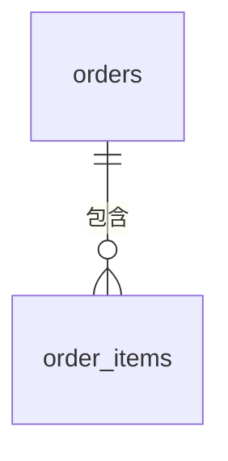
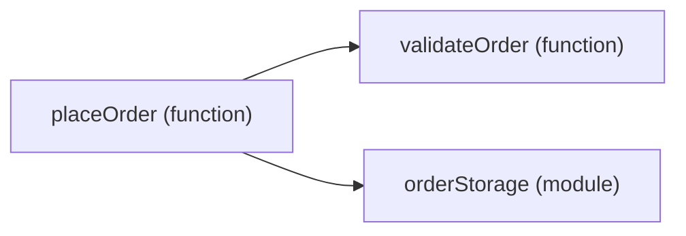

> 适用于 `wiki/c4/code/<system>-<container>-<component>.md`，并使用 `type: code`。basename 继承父 Component，`name` 使用 `<Component Name> Code`。


> 你应使用以下模板集中描述一个 Component 内部的关键代码元素。每个 Component 最多对应一份 Code 页面。

---
name: "<Component Name> Code"
type: code
relations: []
---

## Overview

<说明所属 Component 的关键代码如何组织，以及这种组织如何实现组件职责。>

## Code Structure

<使用 Mermaid `flowchart` 配合文字说明需要特别详细解释的代码组织、职责、结构关系和必要设计理由。数据库结构可使用 `erDiagram`。>

## Boundaries

<说明本页覆盖的组件内部结构，以及明确排除的职责和实现细节。>

> **图示选择**

> 你应根据实际实现方式选择结构图，并将其放入 `Code Structure`。以下示例只展示语法，元素和关系需替换为当前代码或 Schema 中可验证的内容。

> Java 等面向对象实现使用流程图表达关键类和方法之间的处理关系：


> 以数据库表为核心的结构使用实体关系图：



> 函数或模块组织使用静态依赖图：



> **可选章节**

> 你应仅在有助于解释结构设计时，在 `Code Structure` 与 `Boundaries` 之间按以下顺序加入需要的章节。

```markdown
## Technology

- <一种影响代码组织的技术：可靠来源存在具体版本时写明版本；需要时补充结构设计作用。>

## Contract

<说明影响代码组织的输入、输出、失败或兼容边界。只保留承载设计意图的签名。>

## State and Data

<说明影响代码组织的状态所有权和一致性边界。生命周期事件需说明触发时机、释放或保留的状态，以及事件后仍可使用的结果。>

## Invariants

- <解释结构设计所需的关键不变量。>
```

> **填写说明**
>
> 你应让图示与文字共同解释组件内部代码组织：
>
> - 只假定读者已阅读直接父 Component。先解释代码元素的职责，再使用标识符。
> - 只展示具有解释价值的元素、属性、方法和关系，不逐项复述图示或源码控制流。
> - 将所有内部元素限定在所属 Component 内。页面之间的架构交互按公共规则记录在 YAML `relations`。
> - 定位存在歧义时，在相关说明中补充路径或限定名称。
> - 图示证据不足时，说明缺口并暂停补写无法确认的部分。
> - `Technology` 每条列表项只描述一种技术。
> - 可选章节没有解释增量时直接省略。
> - `Boundaries` 同时说明适用范围和明确排除项。
> - 没有出站架构关系时使用 `relations: []`。
>
> 你应删除所有占位符和不适用的示例项。
