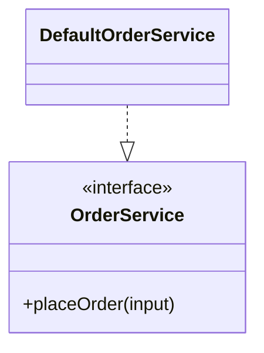

> 适用于 `wiki/c4/components/<system>-<container>-<component>.md`，并使用 `type: component`。


> 你应使用以下模板说明组件职责，并提供主要接口和入口的代码映射。

---
name: "<Canonical English Component Name>"
type: component
children:
  - target: "[[c4/code/<system>-<container>-<component>]]"
relations:
  - target: "[[c4/components/<system>-<container>-<target-component>]]"
    description: "<该 Component 对目标执行的直接交互>"
    mechanism: "<可选交互协议或机制>"
---

## Overview

<说明该 Component 是什么、处理什么，以及向所属 Container 提供什么结果。>

## Responsibilities

- <该 Component 独立拥有的功能责任。>

## Interfaces

- <稳定 port、逻辑接口或契约组：主要输入输出和失败边界。>

## Code Diagram

<说明主要接口、入口和必要实现类型的职责，并用实际代码标识符替换下图示例。该图是本 Component 的代码视图；只有通过 L4 门槛时，才链接到 Code 页面查看更详细的代码组织。>



<存在 Code 页面时，链接到 ../code/<system>-<container>-<component>.md，供读者下钻了解内部组织。>

## Boundaries

<说明功能范围、明确非职责，以及不能越过的分层或所有权限制。>

> 你应在 framework、library 或实现机制影响架构理解时，在 `Responsibilities` 与 `Interfaces` 之间插入：

```markdown
## Technology

- <一种影响该 Component 架构理解的技术：可靠来源存在具体版本时写明版本；需要时补充架构作用。>
```

> 你应在 Component 拥有或协调状态时，在 `Code Diagram` 与 `Boundaries` 之间插入：

```markdown
## State and Data

<说明状态所有权和一致性边界。生命周期事件需说明触发时机、释放或保留的状态，以及事件后仍可使用的结果。>
```

> **填写说明**
>
> 你应让本页解释组件职责，并提供精简的代码映射：
>
> - `Interfaces` 说明稳定契约组，不枚举全部方法或消费者。
> - `Code Diagram` 始终保留 Mermaid `classDiagram`、`erDiagram` 或 `flowchart`，仅展示主要接口、入口、必要实现类型及帮助理解入口契约的关键方法。
> - 非面向对象实现使用真实 module 或 function 标识符，并用 `<<module>>` 或 `<<function>>` 标明类型。关系只表达实际静态依赖，不虚构类或继承关系。
> - 存在 Code 页面时仍保留精简 Code diagram，并使用带 `.md` 的相对 Markdown 链接提供下钻入口。
> - 定位存在歧义时，在相关说明中补充路径或限定名称。
> - 图中符号和关系需有当前代码或 Schema 支持。证据不足时说明缺口，暂停补写无法确认的部分。
> - 正文只假定读者已阅读直接父 Container，不假定读者了解局部实现。
> - 项目专有概念首次出现时先用自然中文解释，再按 Glossary 准入结果添加相对 Markdown 链接。
> - `Interfaces` 先说明输入输出和失败边界，再使用代码标识符补充定位。
> - `Technology` 每条 `-` 列表项只描述一种技术，不合并多种技术。
> - `Technology` 和 `State and Data` 没有解释增量时直接省略。
> - `Boundaries` 同时说明适用范围和明确排除项。
> - 内部代码的详细分组和协作由可选 Code 页面解释；本页聚焦主要接口和入口。
> - 正文不重复 `children` 或 `relations`。
> - 没有出站关系时，将 front matter 写为 `relations: []`。
>
> 你应删除所有占位符和不适用的示例项。
