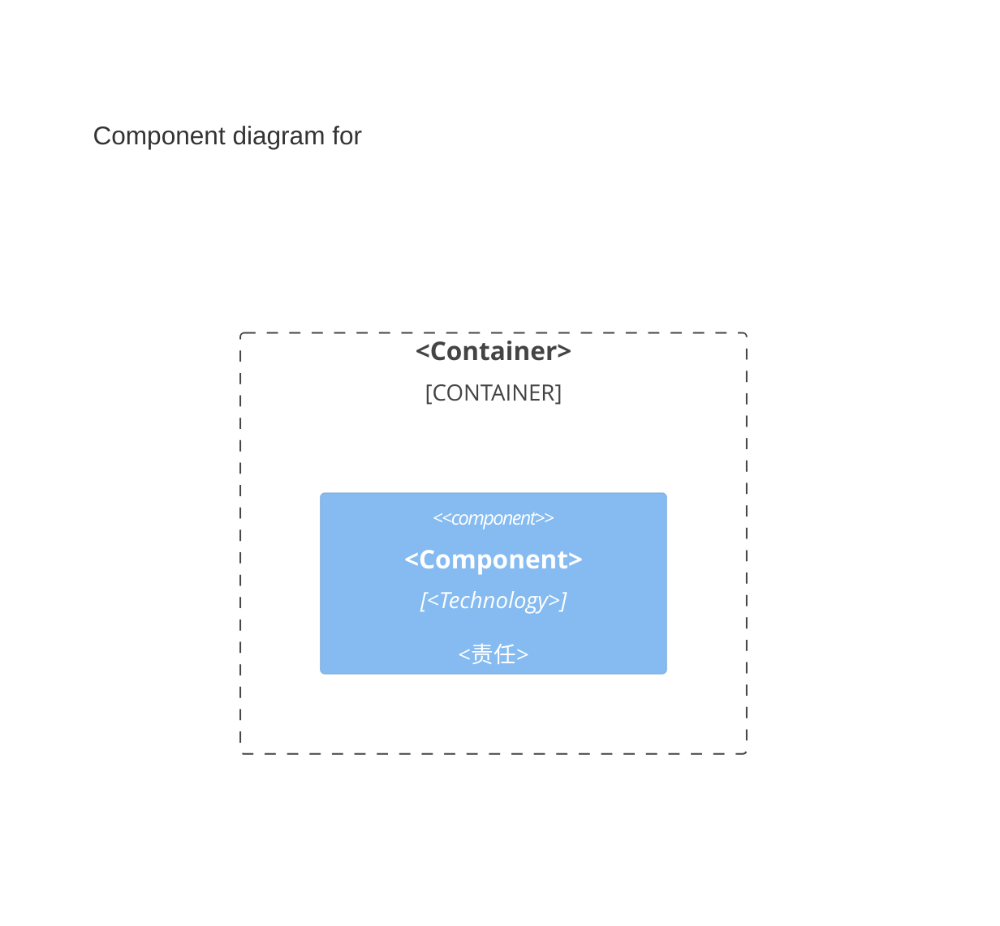

> 适用于 `wiki/c4/containers/<system>-<container>.md`，并使用 `type: container`。


---
name: "<Canonical English Container Name>"
type: container
children:
  - target: "[[c4/components/<system>-<container>-<component>]]"
relations:
  - target: "[[c4/containers/<system>-<target-container>]]"
    description: "<该 Container 对目标执行的直接交互>"
    mechanism: "<可选交互协议或机制>"
---

## Overview

<说明 application、data store、batch process 或其他运行边界的类型和用途。>

## Responsibilities

- <该 Container 自身执行、存储或协调的稳定责任。>

## Technology

- <一种 runtime、framework、storage engine 或关键平台：可靠来源存在具体版本时写明版本；需要时补充架构作用。>

## Interfaces

- <稳定入站契约组：目的、主要输入输出和失败边界。>

## Component Diagram



> <使用真实 Component 和直接关系替换示例。图中每个 Component 必须有对应页面。>

## Boundaries

<说明运行范围和明确非职责。区分容易混淆的相邻边界。>

> 拥有、持久化或协调状态时，在 `Interfaces` 与 `Boundaries` 之间插入：

```markdown
## State and Data

<说明状态所有权和一致性边界。生命周期事件需说明触发时机、释放或保留的状态，以及事件后仍可使用的结果。>
```

> **填写说明**
>
> - `Technology` 描述 element 自身技术，不描述 relation 的交互机制。
> - `Technology` 每条 `-` 列表项只描述一种技术，不合并多种技术。
> - 可靠来源存在具体版本时保留版本。没有可靠来源时不猜测。
> - `Interfaces` 可以链接 canonical API、事件定义或 Schema。
> - `Interfaces` 不枚举全部 endpoint、字段或消费者。
> - `State and Data` 没有解释增量时直接省略。
> - `Boundaries` 同时说明适用范围和明确排除项。
> - 正文不重复 `children` 或 `relations`。
> - 没有出站关系时，将 front matter 写为 `relations: []`。
>
> 删除所有占位符和不适用的示例项。
