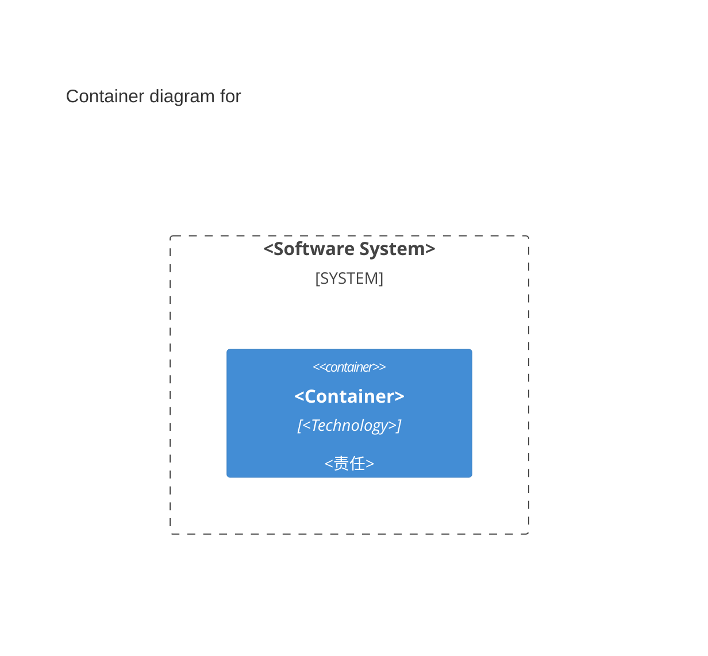

> 适用于 `wiki/c4/software-systems/<system>.md`，并使用 `type: software-system`。

---
name: "<Canonical English Software System Name>"
type: software-system
children:
  - target: "[[c4/containers/<system>-<container>]]"
relations:
  - target: "[[c4/software-systems/<external-system>]]"
    description: "<该系统对目标系统执行的直接交互>"
    mechanism: "<可选交互协议或机制>"
---

## Overview

<最多三句说明系统为谁提供什么独立价值。>

## Responsibilities

- <系统边界内拥有的稳定责任。>

## Container Diagram

> <使用真实 Container、技术和直接关系替换示例。图中每个 Container 必须有对应页面。>

## Boundaries

<说明系统内外、所有权和明确排除项。>

> **填写说明**
>
> - `Overview` 在技术栈整体替换后仍然成立。
> - 正文引用 Actor 或其他 Wiki 页面时使用相对 Markdown 链接。
> - `Responsibilities` 不枚举 Use Case Realization。
> - `Boundaries` 同时说明适用范围和明确排除项。
> - 技术栈、Container、部署节点和内部模块不进入 Software System 正文。
> - 没有出站关系时，将 front matter 写为 `relations: []`。
>
> 只有证据明确时才保留 `mechanism`。删除所有占位符和不适用的示例项。
