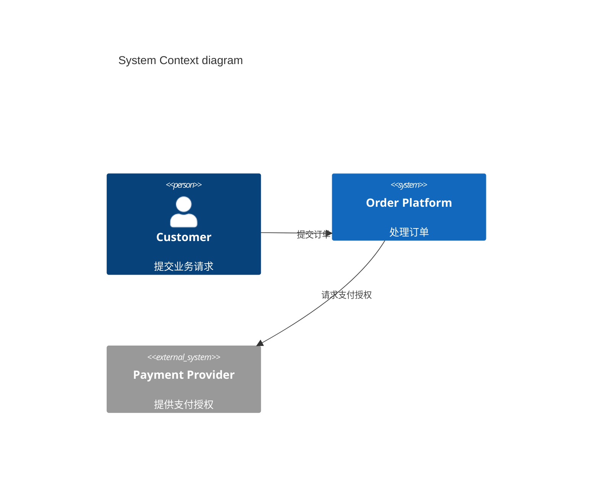

> 适用于 `wiki/c4/system-arch.md`，并使用 `type: system-context`。该页面是 Wiki 唯一的系统上下文图页。

---
name: "<Canonical English Project System Context Name>"
type: system-context
children:
  - target: "[[c4/software-systems/<system>]]"
---

## Overview

<说明图示覆盖的系统范围，以及读者如何从图进入 Software System 页面。>

## System Context Diagram

> <图中每个节点和关系都必须对应现有 C4 页面及其 YAML `relations[].target`；替换示例元素，不从图中反向创建未经准入的页面。>

## Boundaries

<说明图示的系统范围，以及明确排除的内部 Container、部署节点和未直接交互的外部系统。>

> **填写说明**
>
> - 图中只放 Actor、in-scope Software System、直接相关的 external Software System 和它们的直接关系。
> - 节点名称和关系方向应与对应页面的 `name`、`relations[].target` 和 `description` 一致。
> - Container、Component、技术选型和部署设施进入下级页面，不在本页展开。
> - 没有可靠证据支持的节点或关系不进入图示；先补充来源或暂停更新。
> - 正文不复制 C4 element 的 `children` 或 `relations`，只说明图示范围和阅读入口。
>
> 删除所有占位符和不适用的示例项。
