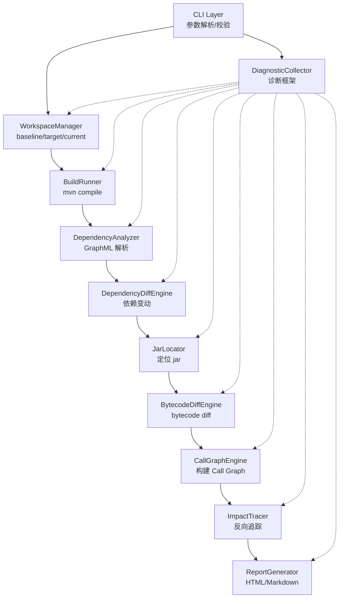

# Architecture: Analysis Pipeline Architecture

## Summary

分析流水线采用线性阶段架构，每个阶段独立可验证，后续阶段依赖前序阶段产物。所有阶段共享统一的诊断框架，通过 `DiagnosticCollector` 收集阶段日志、耗时和失败原因。

## Structure

- **CLI Layer**: 参数解析、校验、退出码、总流程编排。
- **Diagnostics**: 贯穿所有阶段的诊断事件收集，支持 stage/level/message/side/module/artifact/path/elapsedMillis。
- **WorkspaceManager**: 准备 baseline、target、current workspace 三类分析输入，使用 git worktree 隔离。
- **BuildRunner**: 调用用户环境默认 `mvn` 编译，收集 main classes。
- **DependencyAnalyzer**: 调用 Maven dependency plugin 输出 GraphML 并解析为结构化依赖树。
- **DependencyDiffEngine** (待实现): 对比两侧 resolved dependency tree，生成依赖变动。
- **JarLocator** (待实现): 从 Maven local repository 定位 version changed 依赖 jar。
- **BytecodeDiffEngine** (待实现): 对 old/new jar 做 bytecode diff，生成 ChangePoint。
- **CallGraphEngine** (待实现): 基于业务代码 main classes 构建全局 Call Graph。
- **ImpactTracer** (待实现): 从变化点反向追踪受影响业务方法。
- **ReportGenerator** (待实现): 生成单文件 HTML 或 Markdown 报告。

## Architecture Diagram

## Key Terms

- `side` - 分析的一侧，取值为 `baseline`、`target` 或 `current`。
- `workspace` - 一个 side 对应的文件系统路径，可以是临时 worktree 或用户当前工作目录。
- `reactor module` - 多模块 Maven 项目中，属于同一构建反应的模块，不作为第三方依赖处理。
- `DependencyNode` - resolved dependency tree 中的一个节点，包含 artifact 坐标、scope 和子节点。
- `ModuleDependencyTree` - 一个 Maven 模块的完整依赖树，包含模块坐标和所有 DependencyNode。

## Key Decisions

- **使用用户环境默认 `mvn`**：不内嵌 Maven Resolver，不绕过用户 `settings.xml`、mirror、proxy、local repository。保证构建行为与用户真实环境一致。
- **Git worktree 隔离**：baseline 和 target commit 使用 `git worktree` 创建临时目录，避免 checkout 污染用户工作区。current workspace 不 checkout、不 stash。
- **GraphML 作为依赖树交换格式**：通过 `maven-dependency-plugin:tree -DoutputType=graphml` 获取 resolved dependency tree，保留传递依赖和依赖调解结果。
- **阶段线性编排**：每个阶段独立可验证，后续阶段依赖前序阶段产物。任一阶段失败即终止，不继续后续阶段。

## Runtime Flow

1. CLI 解析参数并校验。
2. `WorkspaceManager` 准备 baseline 和 target workspace。
3. `BuildRunner` 对每个 side 执行 `mvn compile`，收集 main classes。
4. `DependencyAnalyzer` 对每个 side 执行 `mvn dependency:tree`，解析 GraphML。
5. `DependencyDiffEngine` 对比两侧依赖树，生成 `DependencyChange` 清单。
6. `JarLocator` 为 `version_changed` 依赖定位 old/new jar。
7. `BytecodeDiffEngine` 对 jar 做 bytecode diff，生成 `ChangePoint`。
8. `CallGraphEngine` 构建业务代码全局 Call Graph。
9. `ImpactTracer` 从变化点反向追踪受影响业务方法。
10. `ReportGenerator` 生成最终报告。
