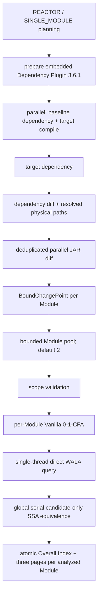

# Architecture: Dependency Analysis Pipelines

## Summary

Root CLI 分发 `impact` 与 `tree`。`impact` 面向 Maven、Spring backend、JDK 8：只编译 target，只构建 target per-Module Call Graph；baseline 仅提供 dependency tree、old artifact path、old bytecode 和按需 old SSA。`tree` 保持独立 repository/reactor HTML pipeline。

## Impact Runtime Flow

## Module Contract

- Reactor root：target reactor 执行一次 `mvn compile`；全部 active、analysis-eligible Module 独立分析。
- Leaf Module：从所属 reactor root 执行 `-pl <relativePath> -am compile`；只报告当前 Module。
- 当前 Module classes 为 `PROJECT`；上游 reactor Module 为 `REACTOR_DEPENDENCY`；外部 artifact 为 `DEPENDENCY`；JDK 8 为 `JDK`。
- 只有 `PROJECT` method 成为 entrypoint。其他 origin 由 reachability 进入。
- 每个 Module 拥有独立 scope、ownership index、CHA、WALA graph 和 cache。不同 Module 不共享可变 WALA 状态。

## Concurrency Contract

- baseline dependency 与 target build 两个 Maven process 并行；任一失败时取消另一 process tree。
- 两者 join 后才运行 target dependency；同一 target workspace 不并发执行两个 Maven process。
- Baseline/target dependency 使用同一内嵌 `3.6.1` Plugin runtime、fully-qualified `tree`/`list` goal 与 settings overlay；target compile 不使用 overlay。
- JAR diff 使用 `max(1, availableProcessors / 2)` bounded pool，并按 physical old/new pair 去重。
- 每个 Module 内 WALA build/query 单线程；Module 之间按 `--module-parallelism` 并行，默认 `2`。
- SSA equivalence 全局串行。
- Module 普通 failure/timeout 不取消其他 Module；global preparation failure 不替换旧 Report。

## Failure and Publication

- JAR pair failure：关联 Module 为 `INCONCLUSIVE_BYTECODE_DIFF`；其他 pair 继续。
- Module failure：其他 Module 继续；生成 `PARTIAL_SUCCESS` 或 all-failed `FAILED` HTML Report。
- `SUCCESS`/`INCONCLUSIVE` exit `0`；`PARTIAL_SUCCESS`/`FAILED` exit `2`；参数或 Preflight failure exit `1`。
- Report 使用 staging，先写每个非-skip Module 的 Module Index、Affected Call Chains、Dependency Changes，再写 Overall Index，最后替换 command-owned output。

## Analysis Model Boundaries

- Call Graph 是 Vanilla 0-1-CFA over-approximation。
- Reflection/MethodHandle 使用 WALA `FULL`/MethodHandle extension，属于 best-effort。
- ServiceLoader 使用 conservative overlay，允许 false-positive。
- Spring DI/AOP/annotation/XML/config、custom classloader 不完整建模。
- 只允许 `PROVEN_EQUIVALENT` 删除 Impact Paths；`UNKNOWN` 保留路径。
- “无路径”只表示在声明的 analysis model 内未发现 Impact Path。
