# Architecture: Dependency Analysis Pipelines

## Summary

Root CLI 分发 `impact` 与 `tree`。`impact` 面向 Maven、Spring backend、JDK 8：只编译 target，只构建 target per-Module Call Graph；baseline 仅提供 dependency tree、old artifact coordinate、old bytecode 和按需 old SSA。默认 `changed-paths` 从 target occurrence graph 恢复全部 `Module direct dependency -> changed dependency` 路径并集，只裁剪路径外 external method body；所有 classes、resources 与 JAR 仍进入 AnalysisScope 和 Class Hierarchy Analysis（CHA）。`tree` 保持独立 repository/reactor HTML pipeline。

## Architecture Diagram

```mermaid
flowchart TD
  Scope["REACTOR / SINGLE_MODULE planning"] --> Plugin["prepare embedded tree + Artifact Path Plugins"]
  Plugin --> Front
  Front["parallel: baseline dependency + target compile"] --> TargetDep["target dependency"]
  TargetDep --> DepDiff["dependency diff + coordinate repository"]
  DepDiff --> JarDiff["deduplicated parallel coordinate-pair JAR diff"]
  JarDiff --> Bind["BoundChangePoint per Module"]
  Bind --> PathPlan["all reverse paths to changed dependency; union or full fallback"]
  PathPlan --> EntrySelection["immutable target/classes entrypoint class index"]
  EntrySelection --> ModulePool["bounded Module pool; analysis parallelism"]
  ModulePool --> ScopeValidation["scope validation"]
  ScopeValidation --> Strategy["Factory selects strategy + dependency body policy"]
  Strategy --> CFA["one per-Module WALA Call Graph + immutable metadata"]
  CFA --> Query["read-only query + typed access resolution"]
  Query --> Coverage["typed limitation reduction"]
  Coverage --> SSA["global serial candidate-only SSA equivalence"]
  SSA --> Decompile["parallel path-related code comparison"]
  Decompile --> Report["atomic Overall Index + three pages per analyzed Module"]
```

## Key Terms

- `front preparation`：并行执行 baseline dependency collection与target compile的command前半段。
- `Module analysis`：每个 relevant target Module独立拥有scope、CHA、selected WALA graph与query session的阶段。
- `command-scoped repository`：按`ArtifactCoord`提供validated JAR lease且不向业务domain暴露physical path的immutable repository。

## Architecture Decision Records

- target每个Module只构建一张 selected Call Graph；baseline不compile也不构图，以控制CPU、heap和workspace成本。
- `--call-graph-algorithm` command-wide选择 `rta`、`zero-cfa`、`optimized-0-1-cfa`或`1-object-1-call-site`，默认`rta`；同一次command的全部Module使用一致analysis model，不自动fallback。
- `--dependency-analysis-scope` command-wide 选择 `changed-paths` 或 `full`，默认 `changed-paths`。Requested mode 与 per-Module actual mode 分开保存；occurrence graph 无法稳定恢复全部路径时，仅该 Module 自动 fallback 到 `full` 并记录 typed reason。
- `changed-paths` 不删除 artifact：全部 target external JAR、resource、reactor classes 和 JDK 仍进入 scope/CHA/ownership/model resolution。Optimization 只影响 resolved external `IMethod` 的 IR policy。
- 四种Call Graph实现通过唯一Factory选择独立strategy。`BasicRTABuilder`、两种`ZeroXCFABuilder`与复合`nObjBuilder`/`nCFAContextSelector`只存在于对应strategy；pipeline依赖immutable request/result与统一metadata shape，不依赖builder capability adapter。
- `--wala-reflection-options`同样command-wide，默认`ONE_FLOW_TO_CASTS_APPLICATION_GET_METHOD`；实际值穿过pipeline configuration、strategy、Diagnostic与Report，不由algorithm隐式覆盖。
- Call Graph完成后所有Impact query只读，不允许overlay、第二张graph或whole-scope补扫，确保结果来源单一且可解释。
- Scope/model/query limitation通过统一`CoverageLimitation` contract单向汇入reducer；固定reason precedence不读取exception message、summary或HTML。

## Runtime Flow

- Root CLI完成preflight与scope planning后，front preparation并行收集baseline dependency并编译target。
- Target dependency、dependency diff和JAR diff完成后，ChangePoint按Module绑定。每个 Module 使用 target occurrence graph 从所有 matching seed 沿全部 parent edge 反向恢复到 Module root；路径、多 occurrence 和多 seed 取并集，禁止沿 seed child edge扩展。
- 每个Module依次执行path planning、scope validation、selected strategy build、read-only query与typed coverage reduction；全局随后串行执行SSA equivalence，再并行生成code evidence。
- Overall与Module pages全部写入staging成功后，原子替换command-owned Report。

## Module Contract

- Reactor root：target reactor 执行一次 `mvn compile`；全部 active、analysis-eligible Module 独立分析。
- Leaf Module：从所属 reactor root 执行 `-pl <relativePath> -am compile`；只报告当前 Module。
- 当前 Module classes 为 `PROJECT`；上游 reactor Module 为 `REACTOR_DEPENDENCY`；外部 artifact 为 `DEPENDENCY`；JDK 8 为 `JDK`。
- Entrypoint class仅由当前 Module `target/classes` index产生；interface、annotation与private nested class排除，abstract class的non-private、non-abstract declared method保留。Private constructor/method不成为root，但继续保留在scope并可通过普通调用进入graph。Repeatable slash selector可缩小roots；门禁与Call Graph构造复用同一个immutable index，ownership/classpath precedence不参与root识别。
- 每个 entrypoint JVM parameter slot只使用一个 declared-type candidate；resolved interface/abstract type使用共享 synthetic placeholder，不枚举 concrete subtype或implementor。Selector与 placeholder均不裁剪 scope、CHA、Reflection、model provider或其他 origin reachability，但可能遗漏 implementation-only impact path。
- 每个 Module 拥有独立 scope、ownership index、CHA、WALA graph 和 cache。不同 Module 不共享可变 WALA 状态。
- Scope planning 必须读取保留 occurrence identity 与 multi-parent edge 的 `ModuleDependencyOccurrenceGraph`。First-wins flattened tree 继续服务 coordinate projection，但禁止用它反推到达 seed 的路径。
- `PROJECT`、`REACTOR_DEPENDENCY`、JDK、SYNTHETIC 与 selected external artifact 始终使用真实 IR/现有 model。Unselected external artifact 的 resolved method 使用 no-op 或 caller/call-site-specific flow-to-cast factory IR；policy 依据 resolved declaring class logical source，不依据 call-site declared owner。

## Concurrency Contract

- baseline dependency 与 target build 两个 Maven process 并行；任一失败时取消另一 process tree。
- 两者 join 后才运行 target dependency；同一 target workspace 不并发执行两个 Maven process。
- Baseline/target dependency 使用同一内嵌 Plugin runtime、settings overlay，并在各自单个 Maven process/session 中执行 fully-qualified `tree` 与 `resolve-artifact-paths` goal；target compile 不使用 overlay。
- GraphML 是 `impact` 唯一的 mediation authority；Artifact Path Plugin 不执行第二次 collection，JSON 只为 command-scoped `IJarRepository` 提供初始化 binding。非 `system` binding 来自 Resolver result，`system` binding 来自 effective `MavenProject.systemPath`。Repository 构建后以 `ArtifactCoord` 为唯一 key，业务对象不保留 dependency JAR path。Analyzer 按 Module baseDirectory/coordinates 配对并验证 external dependency set 完全一致。Reactor dependency 不发起 artifact resolution，target 阶段映射到 `target/classes`。
- `--analysis-parallelism` 默认 `2`，分别控制 Module analysis、JAR diff 和 decompile bounded pool；各阶段再按 task 数计算 actual workers。超过 CPU 只 warning。
- JAR diff 按 logical old/new coordinate pair 去重；code comparison 按 coordinate pair/member 去重并跨 Module 复用。physical path 只存在于 repository 内部和短生命周期 `JarLease`。
- 每个 Module 内 WALA build/query 单线程；Module 之间并行。
- SSA equivalence 全局串行。
- Module 普通 failure/timeout 不取消其他 Module；global preparation failure 不替换旧 Report。
- relevant Module 未匹配用户 entrypoint selector 时为 `SKIPPED_USER_ENTRYPOINT_SCOPE`；所有 relevant Module 都未匹配时属于 command failure，不替换旧 Report。

## Failure and Publication

- JAR pair failure：关联 Module 为 `INCONCLUSIVE_BYTECODE_DIFF`；其他 pair 继续。
- Module failure：其他 Module 继续；生成 `PARTIAL_SUCCESS` 或 all-failed `FAILED` HTML Report。
- `changed-paths` graph validation、seed matching 或完整 path recovery 失败：该 Module actual mode 为 `full`，继续分析并在 Report 展示 fallback reason。
- dangerous transfer、flow-to-cast factory 或其他明确 typed body-boundary limitation：Module 为 `INCONCLUSIVE_DEPENDENCY_BODY_BOUNDARY`；普通 no-op external call 不单独降级。
- `SUCCESS`/`INCONCLUSIVE` exit `0`；`PARTIAL_SUCCESS`/`FAILED` exit `2`；参数或 Preflight failure exit `1`。
- Report 使用 staging，先写每个非-skip Module 的 Module Index、Affected Call Chains、Dependency Changes，再写 Overall Index，最后替换 command-owned output。

## Analysis Model Boundaries

- Call Graph 是 selected WALA over-approximation：RTA按全局已实例化compatible class求virtual/interface reachability；ZeroCFA按class合并普通allocation并保留constant identity；optimized 0-1-CFA保留allocation-site/constant identity并smush高成本对象；1-object-1-call-site使用一层receiver allocation string和一层call string，保留精确allocation-site且不smush。
- `changed-paths` 中路径外 external method 默认 summary 不包含内部 call、field read/write、callback、exception或thread行为。它保留 caller 到 resolved callee 的 edge，并按 return type返回正常默认值。
- 当 invoke reference result 在同一 caller IR 中仅经 bounded direct/phi/pi flow 到达 concrete、可解析且处于真实 IR scope 的 `checkcast` target 时，factory summary 分配该类型并返回，不显式调用 constructor。该近似产生 typed evidence 和 `INCONCLUSIVE`。
- Reachable no-op callee 收到可证明为 changed class 实例的 receiver、argument、array 或 varargs 元素时记录 dangerous transfer；只声明为 `Object` 且无法恢复实际类型时不猜测。
- Entrypoint fake receiver/parameter只表达 declared interface/abstract type，不探索真实 implementation；因此 implementation-only path可能不可达。
- Reflection使用command选择的WALA `ReflectionOptions`；默认是bounded `ONE_FLOW_TO_CASTS_APPLICATION_GET_METHOD`。三种points-to strategy由各自MethodHandle installer安装WALA extension，RTA installer仅使用reachable caller-local IR/DefUse推导已支持的`findStatic` target；resolution保存operation、caller stable identity、bytecode PC与resolved binary identity。
- `ServiceLoaderProtocolIndex`由engine在strategy前读取、验证并冻结一次；RTA、ZeroCFA、optimized与1-object-1-call-site installer分别安装local checkcast、constant aggregate或allocation-site execution，不共享含algorithm分支的mutable execution state。
- ServiceLoader 与注册的 `invokedynamic` 协议在 `makeCallGraph(...)` 前安装 WALA model，参与 points-to/call graph fixed point；构图后不允许 overlay 补图或 whole-scope JAR/classfile 重扫。
- 非 constant ServiceLoader service type、非法 provider 与 reachable unknown bootstrap 产生 stable limitation，并使 Module `INCONCLUSIVE`。
- Spring DI/AOP/annotation/XML/config、custom classloader 不完整建模。
- 只允许 `PROVEN_EQUIVALENT` 删除 Impact Paths；`UNKNOWN` 保留路径。
- Access narrowing只读target CHA/IR与raw Structural Reference index；不创建baseline CHA/Call Graph，也不向任何Call Graph strategy注入points-to value。
- Dependency Changes 只展示 candidate/final Impact Path 或 Structural Reference Path 关联 member；SSA-filtered candidate 仍保留调用链和 decompiled code evidence。
- `SUCCESS` 只表示 selected dependency path 与已建模 boundary 内未发现 Impact Path；不保证 no-op dependency 内部不存在影响。
