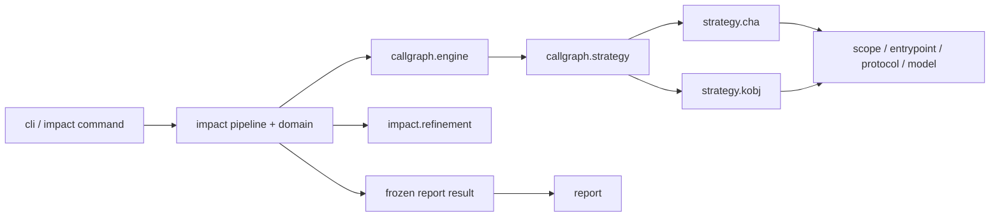

# Architecture: Dependency Analysis Pipelines

## Summary

Root CLI 分发 `impact` 与 `tree`。`impact` 只编译 target，并为每个 relevant Module 构建一张 selected Call Graph；baseline 提供 dependency evidence 与 old artifact。默认组合为 `cha + changed-paths + jdk-model none + result refinement none`。`k-obj` 是显式选择的实验性 algorithm。

`ImpactCommand`通过`ImpactExecutionEngine`启动默认per-Module实现；Relevant Module按stable key串行。当前Module依次完成Call Graph、单线程Evidence analysis、Impact Query、optional refinement、Final/Structural code comparison与report-safe snapshot后，才进入下一个Module。`TreeCommand`只承载CLI，`TreeExecutionEngine`负责preflight、Reactor processing与发布。两条pipeline不共享业务Stage，只共享runtime、workspace、Console diagnostics与command runtime基础设施。

## Key Terms

- Execution Engine：命令级业务编排边界。Impact以接口表达，Tree以独立执行器表达；都不负责Picocli option定义。
- Evidence analysis：Call Graph fixed point完成后的单线程阶段，包含Structural metadata scan、唯一Call Graph node scan与统一binding。
- Reverse BFS binding：`QueryNode -> ChangePointTerminal`辅助索引；只为Reverse BFS导航，不替代`BoundChangePoint` resolution事实。
- Finalization：把coverage、query和stage metrics组装成Module结果，并在Report cache前移除live WALA对象。

## Architecture Decisions

### 构图后收集，不接入fixed point callback

WALA没有稳定的`CGNode + IR`新增通知接口；CHA与`k-obj`内部接入点不同。Evidence analysis因此只消费最终Call Graph，避免sealed replay、node去重和interpreter补偿逻辑。

### Evidence顺序扫描，QueryNode并发

Evidence阶段不复制node集合、不并发调用`CGNode.getIR()`。并发只发生在只读、按exact QueryNode隔离的Reverse BFS和后续code comparison，确保资源上界清晰。

### 不建立通用Stage或Artifact总线

命令引擎直接连接现有typed领域实现；阶段输入输出使用`ModuleAnalysisUnit`、`ModuleCallGraphSession`、`ChangePointEvidenceIndex`和`ModuleImpactQueryResult`。不允许弱类型artifact map或可改变核心顺序的任意回调。

## Package Dependency Direction

禁止反向边：`callgraph.. -> impact..`、`callgraph.. -> report..`、`report.. -> strategy.cha..|strategy.kobj..`。CHA 与 `k-obj` implementation 不互相引用；公共 protocol 不依赖 strategy 或 engine。

## Impact Flow

```mermaid
flowchart TD
  Scope["repository / Module scope planning"] --> Prepare["baseline dependency + target compile"]
  Prepare --> Evidence["Schema v3 dependency evidence"]
  Evidence --> Diff["dependency + bytecode + resource diff"]
  Diff --> Bind["BoundChangePoint per Module"]
  Bind --> PathPlan["changed-path union or full scope"]
  PathPlan --> Input["ModuleCallGraphInputAdapter"]
  Input --> Validate["Call Graph scope validation"]
  Validate --> Build["ModuleCallGraphEngine"]
  Build --> Metadata["freeze graph + Call Graph metadata"]
  Metadata --> Structural["StructuralImpactScanner"]
  Structural --> Collector["single-pass ChangePointEvidenceCollector"]
  Collector --> Binding["resolution + unified reverseBfsBindings"]
  Binding --> Coverage["CallGraphCoverageMapper"]
  Coverage --> Query["bounded reverse Impact Query"]
  Query --> Local{"CHA local receiver selected?"}
  Local -->|yes| ChaRefine["caller-local receiver edge filter"]
  Local -->|no| SSAChoice{"SSA equivalence selected?"}
  ChaRefine --> SSAChoice
  SSAChoice -->|yes| SSA["serial SSA equivalence"]
  SSAChoice -->|no| Compare["Final/Structural code comparison"]
  SSA --> Compare
  Compare --> Snapshot["unconditional report-safe snapshot"]
  Snapshot --> Report["stream HTML + atomic publication"]
```

## Call Graph Boundary

- `ModuleCallGraphInput` 只携带 module label、class directory、artifact coordinate、scope/body policy、change selector 与 protocol fact。
- Call Graph engine 不接收 `ModuleAnalysisUnit`、`BoundChangePoint` 或 `ModuleChangedPathSelection`。
- `CallGraphBuildContext` 保存公共 WALA 构建数据；`ChaCallGraphRequest` 与 `KObjCallGraphRequest` 保存各自配置。
- Engine 只输出 graph/session、stats、capability、typed protocol limitation、scope warning、boundary finding 与 optional topology。
- `PerModuleImpactPipeline`实现`ImpactExecutionEngine`。Call Graph完成后，`evidence-analysis`先全量扫描effective class metadata，再在同一线程遍历最终Call Graph一次；不建立node/IR snapshot，不创建Evidence线程池。
- `ChangePointEvidenceIndex`以每个`BoundChangePoint`唯一resolution为事实主索引，以exact `QueryNode -> ChangePointTerminal`为Reverse BFS辅助索引。Structural与普通Evidence共用该binding；Query不再按Structural Reference重复扫描Call Graph。
- `CallGraphCoverageMapper`是Call Graph finding到业务coverage reason的唯一转换点。
- Report 只消费 detached immutable snapshot，不读取 live graph、hierarchy、cache 或 concrete strategy。

## Module Contract

- Reactor root：target reactor 执行一次 `mvn compile`；active Module 独立分析。
- Leaf Module：从所属 reactor root执行 `-pl <path> -am compile`，只报告当前 Module。
- 当前 Module classes 为 `PROJECT`；上游 reactor Module 为 `REACTOR_DEPENDENCY`；外部 selected artifact 为 `DEPENDENCY`；target JDK 为 `JDK`。
- Entrypoint class 只来自当前 Module classes index。Scope、hierarchy、cache 和 Call Graph 均为 per-Module。
- Requested dependency scope 与 actual scope 分开保存。无法稳定恢复完整 changed path 时，只对当前 Module fallback 到 `full`，并生成 typed warning。

## Algorithm and Refinement Contract

- `--call-graph-algorithm` 只接受 `cha`、`k-obj`；默认 `cha`，不自动 fallback。
- CHA 固定 `jdk-model=none`，不应用 Reflection。`k-obj` 默认 `jdk-model=jdk8`，允许显式 `none`，并应用 Reflection。
- `--k-obj-depth` 只对 `k-obj` 合法，默认 `1`。
- `--result-refinement-algorithms` 接受 `cha-local-receiver-inference`、`ssa-equivalence` 或组合，默认 `none`。
- local receiver refinement 只验证已有 CHA predecessor edge；不发现 terminal evidence、不补边、不构建第二张 graph。
- SSA equivalence 在 candidate path 形成后运行；结果类型与 normalization 位于 `impact.refinement.ssa`。

## Concurrency and Lifecycle

- Module 严格串行，避免同时持有多张 WALA graph。
- Impact Query 与 code comparison 受 `--analysis-parallelism` 的 bounded pool 控制。
- 当前Module snapshot无条件把path node转换为`SnapshotQueryNode`，把method Evidence anchor转换为stable-only anchor，清空只供Reverse BFS使用的binding并释放live WALA state；该生命周期不依赖`ReportCache`是否存在。
- Impact正常HTML发布不启用`ReportCache`，也不写`candidate-path`、`final-path`、`structural-path`、`observation`或`code-comparison`fragment。只有显式`--call-graph-diagnostics-output`启用cache并在live session期流式写`diagnostic-module`fragment。
- HTML只读取已冻结Module result；显式Schema v9 topology JSON从diagnostic fragment输出。
- Report完整写入同filesystem staging后原子替换；失败清理command-owned cache。

## Failure Boundaries

- Impact全局preparation或publication失败终止command；Module scope、Call Graph、Evidence、Query或finalization失败转换为该Module的typed failure，后续Module继续。
- `ChangePointEvidenceIndex`在binding与resolution不一致时fail-fast，禁止生成缺少terminal事实的路径。
- Tree command-level preflight失败不替换旧Report；Reactor collection失败记录issue并继续；renderer/publisher失败由`TreeExecutionEngine`关闭Report session并返回失败状态。
- 线程中断继续传播；不把partial Evidence index发布为completed Module结果。
