# Architecture: Dependency Analysis Pipelines

## Summary

Root CLI 分发 `impact` 与 `tree`。`impact`只编译target并构建target per-Module Call Graph；baseline仅提供dependency evidence、old artifact、字节码、ServiceLoader resource和按需old SSA。默认配置固定为`cha + changed-paths + jdk-model none`。Module通过rolling bounded queue完成后立即串行执行SSA equivalence、输出cache fragment并脱离WALA graph/session。`tree`逐行解析Maven output，使用cache-backed external grouping并在每个Reactor发布后释放其明细。两条pipeline都通过task-scoped cache和Writer流式Report限制峰值内存。

## Architecture Diagram

```mermaid
flowchart TD
  Scope["REACTOR / SINGLE_MODULE planning"] --> Plugin["prepare embedded tree + Dependency Evidence Plugins"]
  Plugin --> Front
  Front["parallel: baseline dependency + target compile"] --> TargetDep["target dependency"]
  TargetDep --> Evidence["Schema v3: selected winner + normalized occurrence + binding"]
  Evidence --> DepDiff["selected dependency diff + coordinate repository"]
  DepDiff --> JarDiff["bytecode + ServiceLoader resource diff"]
  JarDiff --> Bind["BoundChangePoint per Module"]
  Bind --> PathPlan["all reverse paths to changed dependency; union or full fallback"]
  PathPlan --> EntrySelection["immutable target/classes entrypoint class index"]
  EntrySelection --> ModulePool["rolling bounded Module completion queue"]
  ModulePool --> ScopeValidation["scope validation"]
  ScopeValidation --> Strategy["Factory selects topology strategy + capabilities"]
  Strategy --> CFA["one per-Module WALA Call Graph + strategy artifacts"]
  CFA --> Collector["unified evidence collection + ChangePoint binding"]
  Collector --> Session["freeze graph + evidence + limitations + metadata"]
  Session --> Query["evidence-driven reverse BFS + typed access decision"]
  Query --> SSA["coordinator serial SSA equivalence"]
  SSA --> Spill["JSON Lines snapshot; release WALA session"]
  Spill --> Decompile["bounded code comparison fragments"]
  Decompile --> Report["Writer streaming + atomic publication"]
```



## Key Terms

- `front preparation`：并行执行 baseline dependency collection与target compile的command前半段。
- `Module analysis`：每个 relevant target Module独立拥有scope、CHA、selected WALA graph与query session的阶段。
- `command-scoped repository`：按`ArtifactCoord`提供validated JAR lease且不向业务domain暴露physical path的immutable repository。
- `ChangePointEvidence`：算法无关的typed terminal reference；它不进入WALA Call Graph topology。
- `frozen session`：包含Call Graph、统一evidence、coverage limitation、ownership与strategy metadata的只读Module结果。
- `report-safe snapshot`：只保存stable method identity、origin、Context文本、graph node id、sentinel role与轻量metrics，不引用WALA `CGNode`、class hierarchy、analysis cache或session。
- `task cache`：`CommandRunDirectory` owned UUID目录下的内部versioned JSON/JSON Lines fragment集合；只服务当前command，不是公共artifact或断点续跑格式。

## Architecture Decision Records

- target每个Module只构建一张 selected Call Graph；baseline不compile也不构图，以控制CPU、heap和workspace成本。
- `--call-graph-algorithm` command-wide选择`cha`、`rta`、`zero-cfa`、`optimized-0-1-cfa`或`k-obj`，默认`cha`；同一次command的全部Module使用一致analysis model，不自动fallback。`--k-obj-depth`只对`k-obj`合法，默认`1`且必须为正整数。
- JDK Method Model默认值依algorithm解析：`cha`固定`none`；其他algorithm未指定时为`jdk8`。显式`cha + jdk8`在CLI、pipeline和直接Java API共用的capability validation中失败；其他algorithm仍可显式选择`none`。
- `--dependency-analysis-scope` command-wide 选择 `changed-paths` 或 `full`，默认 `changed-paths`。Requested mode 与 per-Module actual mode 分开保存；occurrence graph 无法稳定恢复全部路径时，仅该 Module 自动 fallback 到 `full` 并记录 typed reason。
- `changed-paths`不删除artifact：全部target external JAR、resource、reactor classes和JDK仍进入scope/CHA/ownership/model resolution。CHA在resolution时裁剪无关external target，但传递保留PROJECT/reactor/selected external class的路径外external祖先type；四种非CHA algorithm继续使用resolved external `IMethod`的IR policy。
- 五种Call Graph实现通过唯一、穷尽Factory选择独立strategy。Strategy只产生topology、protocol summary、typed limitation和标准metadata；不得创建/绑定`ChangePoint`、生成Impact Path或改变disposition/report规则。
- `--wala-reflection-options`同样command-wide，默认`ONE_FLOW_TO_CASTS_APPLICATION_GET_METHOD`。CHA不安装WALA Reflection expansion，Diagnostic和Report显式显示`not applied by cha`；其他algorithm应用实际选择。
- raw structural fact可在构图前采集；所有reference必须在Call Graph完成后、session冻结前由统一collector绑定。冻结后的Impact query不得重扫IR发现reference、overlay、补边、构建第二张graph或whole-scope重扫。
- Removed class、method、field与resource永远只作为evidence terminal；不得进入WALA Call Graph node/edge。`CallEdgeKind`只表示真实调用边或protocol edge。
- Scope/model/query limitation通过统一`CoverageLimitation` contract单向汇入reducer；固定reason precedence不读取exception message、summary或HTML。
- `impact`与`tree`共用`ReportTaskCache`，不另建cache root或锁协议。Fragment采用UTF-8、stable-hash filename、temporary write、atomic rename与complete marker；manifest保存schema、run ID、command、完成状态和稳定排序引用。
- Report成功原子发布、analysis/report/publication失败都会显式清理`report-cache`；清理失败作为command错误。外层`CommandRunDirectory.close()`仍回收整个owned UUID目录，异常退出由下次stale recovery清理。

## Runtime Flow

- Root CLI完成preflight与scope planning后，front preparation并行收集baseline dependency并编译target。
- Baseline/target dependency collection分别产出`ModuleDependencyEvidence`。Maven resolved graph决定selected projection与winner；raw graph occurrence直接映射到retained winner，保留topology；Schema v3在同一Module evidence内绑定physical artifact。
- Bytecode Diff与ServiceLoader resource Diff完成后，ChangePoint按Module绑定。每个Module使用target evidence的normalized occurrence graph从所有matching winner seed沿全部parent edge反向恢复到Module root；路径、多occurrence和多seed取并集，禁止沿seed child edge扩展。
- Module task只在rolling window内提交；同时最多存在`actualAnalysisParallelism`个live task。Completion queue每取回一个Module，协调线程立即执行该Module的serial SSA equivalence，并在释放session前输出optional diagnostics fragment。
- Module随后转换为report-safe snapshot；candidate/final/structural path、observation与summary逐类写JSON Lines。写完后不再持有WALA `CGNode`、class hierarchy、analysis cache或Call Graph session。
- Code comparison按stable change key去重，通过bounded completion queue生成；完成一项立即写独立fragment。Analysis result、Overall Report与optional diagnostics JSON携带effective algorithm、JDK model、strategy capabilities、Reflection applied状态和Evidence汇总；diagnostics JSON为Schema v8。
- Overall与Module pages使用UTF-8 `Writer`直接写同filesystem staging；完整关闭所有页面后原子替换command-owned Report，任何时刻不构造完整HTML字符串。

## Module Contract

- Reactor root：target reactor 执行一次 `mvn compile`；全部 active、analysis-eligible Module 独立分析。
- Leaf Module：从所属 reactor root 执行 `-pl <relativePath> -am compile`；只报告当前 Module。
- 当前 Module classes 为 `PROJECT`；上游 reactor Module 为 `REACTOR_DEPENDENCY`；外部 artifact 为 `DEPENDENCY`；JDK 8 为 `JDK`。
- Entrypoint class仅由当前 Module `target/classes` index产生；interface、annotation与private nested class排除，abstract class的non-private、non-abstract declared method保留。Private constructor/method不成为root，但继续保留在scope并可通过普通调用进入graph。Repeatable slash selector可缩小roots；门禁与Call Graph构造复用同一个immutable index，ownership/classpath precedence不参与root识别。
- 每个 entrypoint JVM parameter slot只使用一个 declared-type candidate；resolved interface/abstract type使用共享 synthetic placeholder，不枚举 concrete subtype或implementor。Selector与 placeholder均不裁剪 scope、CHA、Reflection、model provider或其他 origin reachability，但可能遗漏 implementation-only impact path。
- 每个 Module 拥有独立 scope、ownership index、CHA、WALA graph 和 cache。不同 Module 不共享可变 WALA 状态。
- Scope planning 必须读取 `ModuleDependencyEvidence` 内保留 occurrence identity 与 multi-parent edge 的 winner-normalized `ModuleDependencyOccurrenceGraph`。Dependency diff、classpath order与reactor closure只读取同一evidence的selected projection；Maven API raw graph不跨越Plugin boundary。
- `ModuleDependencyInputs` 由baseline/target evidence统一创建。Target/baseline artifact list与path policy不能分别注入；`FULL`、fallback、`REAL_IR`与`NO_OP`只允许引用target evidence内的selected bindings。
- `PROJECT`、`REACTOR_DEPENDENCY`、JDK、SYNTHETIC与selected external artifact始终使用真实IR/现有model。CHA额外允许ancestor-retained type的reachable concrete method使用真实IR；其他unselected external target不建node/edge。四种非CHA algorithm的unselected external resolved method继续使用no-op或caller/call-site-specific flow-to-cast factory IR。全部policy依据resolved declaring class logical source，不依据call-site declared owner。

## Concurrency Contract

- baseline dependency 与 target build 两个 Maven process 并行；任一失败时取消另一 process tree。
- 两者 join 后才运行 target dependency；同一 target workspace 不并发执行两个 Maven process。
- Baseline/target dependency 使用同一内嵌 Plugin runtime、settings overlay，并在各自单个 Maven process/session 中执行 fully-qualified `collect-dependency-evidence` goal；target compile 不使用 overlay。
- Maven resolved graph是`impact`唯一mediation与classpath authority；raw occurrence graph只贡献topology，Schema v3为同一`ModuleDependencyEvidence`提供Module-local selected binding。非`system` binding来自Resolver result，`system` binding来自effective `MavenProject.systemPath`。Repository构建后以`ArtifactCoord`为唯一key，业务对象不保留dependency JAR path。只有selected reactor key映射到`target/classes`；未命中retained winner的raw occurrence不扩张reactor closure。
- `--analysis-parallelism` 默认`2`，分别控制Module analysis、JAR diff和code comparison bounded pool；各阶段再按task数计算actual workers。Module analysis使用rolling submission，不预先保存全部`Future`，live task/result上限等于actual workers。超过CPU只warning。
- JAR diff 按 logical old/new coordinate pair 去重；code comparison 按 coordinate pair/member 去重并跨 Module 复用。physical path 只存在于 repository 内部和短生命周期 `JarLease`。
- 每个 Module 内 WALA build/query 单线程；Module 之间并行。
- SSA equivalence由单一协调线程执行；每个Module完成graph/query后立即处理，跨Module不并发。
- Module 普通 failure/timeout 不取消其他 Module；global preparation failure 不替换旧 Report。
- relevant Module 未匹配用户 entrypoint selector 时为 `SKIPPED_USER_ENTRYPOINT_SCOPE`；所有 relevant Module 都未匹配时属于 command failure，不替换旧 Report。

## Failure and Publication

- JAR pair failure：关联 Module 为 `INCONCLUSIVE_BYTECODE_DIFF`；其他 pair 继续。
- Module failure：其他 Module 继续；生成 `PARTIAL_SUCCESS` 或 all-failed `FAILED` HTML Report。
- `changed-paths` graph validation、seed matching 或完整 path recovery 失败：该 Module actual mode 为 `full`，继续分析并在 Report 展示 fallback reason。
- Schema v3 的Module、root、winner occurrence、selected binding或graph validation不一致：dependency preparation fail-fast，不进入Module fallback。
- dangerous transfer、flow-to-cast factory或其他明确typed body-boundary limitation：Module为`INCONCLUSIVE_DEPENDENCY_BODY_BOUNDARY`；四种非CHA algorithm的普通no-op external call和CHA的正常target pruning都不单独降级。
- `SUCCESS`/`INCONCLUSIVE` exit `0`；`PARTIAL_SUCCESS`/`FAILED` exit `2`；参数或 Preflight failure exit `1`。
- Report 使用 staging，先写每个非-skip Module 的 Module Index、Affected Call Chains、Dependency Changes，再写 Overall Index，最后替换 command-owned output。
- Report发布成功后立即删除cache；任一failure path也删除。Manifest、fragment、marker损坏或schema/run/command不匹配时fail-fast，禁止发布不完整Report。

## Task Cache and Bounded Tree Grouping

```text
<config>/<impact|tree>/tmp/<run-uuid>/
  .owner
  report-cache/
    manifest.json
    <kind>-<sha256-prefix>.jsonl
    <kind>-<sha256-prefix>.jsonl.complete
```

- Filename不包含未经验证的Module/reactor name；stable key只参与SHA-256。删除前验证cache位于当前owned temporary directory，cache root/child均不是symbolic link。
- `DependencyTextParser`从`Reader`逐行消费Maven output，不调用`Files.readString`或对完整文本执行`split`。
- Tree occurrence grouping每批最多10,000条或约8 MiB payload，任一阈值先到即stable sort spill；归并fan-in最多32。Module internal conflict只分组当前Module；cross-module conflict只读selected occurrence摘要。
- 每个Reactor将ordered tree record、normalized occurrence、selected reactor dependency摘要与Module metadata写fragment。Reactor page和Index checkpoint均成功后，删除该Reactor cache prefix，只保留`ReactorReportSummary`。

## Analysis Model Boundaries

- Call Graph是selected WALA over-approximation：CHA按完整class hierarchy做context-insensitive dispatch；RTA按全局已实例化compatible class；ZeroCFA按class合并allocation；optimized 0-1-CFA保留allocation-site并smush高成本对象；`k-obj`保留最多`k`层receiver allocation string。
- CHA不构建points-to、heap、跨方法或通用数据流fixed point。唯一值传播是从受支持API参数出发，在单个reachable caller SSA definition上有界回溯String/Class constant。
- CHA `changed-paths`中路径外external target默认不建node/edge；ancestor-retained type是传递type-level例外。四种非CHA algorithm仍为路径外external method使用不含内部call、field read/write、callback、exception或thread行为的summary，并保留caller到resolved callee的edge。
- 当 invoke reference result 在同一 caller IR 中仅经 bounded direct/phi/pi flow 到达 concrete、可解析且处于真实 IR scope 的 `checkcast` target 时，factory summary 分配该类型并返回，不显式调用 constructor。该近似产生 typed evidence 和 `INCONCLUSIVE`。
- Reachable no-op callee 收到可证明为 changed class 实例的 receiver、argument、array 或 varargs 元素时记录 dangerous transfer；只声明为 `Object` 且无法恢复实际类型时不猜测。
- Entrypoint fake receiver/parameter只表达 declared interface/abstract type，不探索真实 implementation；因此 implementation-only path可能不可达。
- 非CHA algorithm使用command选择的WALA `ReflectionOptions`；CHA只用caller-local String constant识别精确`Class.forName(String)` terminal evidence，不创建removed class node、reflection edge或synthetic method。
- `ServiceLoaderProtocolIndex`由engine在strategy前读取、验证并冻结一次；RTA、ZeroCFA、optimized与`k-obj` installer分别安装local checkcast、constant aggregate或allocation-site execution，不共享含algorithm分支的mutable execution state。`k-obj` ServiceLoader Context保留WALA提供的任意合法深度allocation string。
- CHA对精确`ServiceLoader.load(Class)`回溯caller-local Class constant，并将target有效provider的真实public zero-argument constructor作为`SERVICE_LOADER` protocol edge加入构图；baseline/target registration removal仍只绑定公共Evidence terminal。
- 非 constant ServiceLoader service type、非法 provider 与 reachable unknown bootstrap 产生 stable limitation，并使 Module `INCONCLUSIVE`。
- Spring DI/AOP/annotation/XML/config、custom classloader 不完整建模。
- 只允许 `PROVEN_EQUIVALENT` 删除 Impact Paths；`UNKNOWN` 保留路径。
- Access narrowing只读target CHA/IR与raw Structural Reference index；不创建baseline CHA/Call Graph，也不向任何Call Graph strategy注入points-to value。
- Dependency Changes 只展示 candidate/final Impact Path 或 Structural Reference Path 关联 member；SSA-filtered candidate 仍保留调用链和 decompiled code evidence。
- `SUCCESS` 只表示 selected dependency path 与已建模 boundary 内未发现 Impact Path；不保证 no-op dependency 内部不存在影响。
