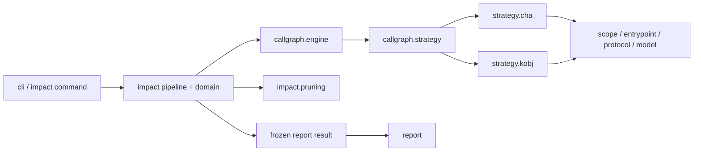

# Architecture: Dependency Analysis Pipelines

## Summary

Root CLI 分发 `impact` 与 `tree`。`impact` 只编译 target，并为每个 relevant Module 构建一张 selected Call Graph；baseline 提供dependency evidence与old artifact。默认组合为`cha + changed-paths + jdk-model none`，Static Single Assignment（SSA，静态单赋值）与decompiled Java equivalence固定启用；CHA固定执行caller-local `cha-local-receiver-inference` Impact Path裁剪extension。`k-obj`是显式选择的实验性algorithm。

`ImpactCommand`通过`ImpactExecutionEngine`启动默认per-Module实现。scope planning后创建唯一command-wide`common`pool，front preparation、logical JAR pair diff、Impact Query与code comparison顺序复用，并统一受`--analysis-parallelism`限制。Relevant Module仍按stable key串行完成Call Graph、单线程Evidence analysis、Impact Query与report-safe snapshot。`TreeCommand`只承载CLI，`TreeExecutionEngine`负责preflight、Reactor processing与发布。

## Key Terms

- Execution Engine：命令级业务编排边界。Impact以接口表达，Tree以独立执行器表达；都不负责Picocli option定义。
- Evidence analysis：Call Graph fixed point完成后的单线程阶段，包含Structural metadata scan、唯一Call Graph node scan与统一binding。
- Reverse BFS binding：`QueryNode -> ChangePointTerminal`辅助索引；只为Reverse BFS导航，不替代`BoundChangePoint` resolution事实。
- Finalization：把coverage、query和stage metrics组装成Module结果，并在Report cache前移除live WALA对象。

## Architecture Decisions

### 构图后收集，不接入fixed point callback

WALA没有稳定的`CGNode + IR`新增通知接口；CHA与`k-obj`内部接入点不同。Evidence analysis因此只消费最终Call Graph，避免sealed replay、node去重和interpreter补偿逻辑。

### Evidence顺序扫描，QueryNode并发

Evidence阶段不复制node集合、不并发调用`CGNode.getIR()`。并发只发生在只读、按exact QueryNode隔离的Reverse BFS和后续code comparison，确保资源上界清晰。

### 不建立通用Stage或Artifact总线

命令引擎直接连接现有typed领域实现；阶段输入输出使用`ModuleAnalysisUnit`、`ModuleCallGraphSession`、`ChangePointEvidenceIndex`和`ModuleImpactQueryResult`。不允许弱类型artifact map或可改变核心顺序的任意回调。

## Package Dependency Direction

禁止反向边：`callgraph.. -> impact..`、`callgraph.. -> report..`、`report.. -> strategy.cha..|strategy.kobj..`。CHA 与 `k-obj` implementation 不互相引用；公共 protocol 不依赖 strategy 或 engine。

## Impact Flow

```mermaid
flowchart TD
  Scope["repository / Module scope planning"] --> Prepare["baseline dependency + target compile"]
  Prepare --> Evidence["Schema v3 dependency evidence"]
  Evidence --> Diff["complete Maven Dependency Diff"]
  Diff --> Selection["dependency-selection: changed JAR Glob boundary"]
  Selection --> JarDiff["selected bytecode + resource diff"]
  JarDiff --> Java["all method body candidates: Vineflower exact text"]
  Java -->|"IDENTICAL: suppress + skip SSA"| Cache["atomic method-body-comparison JSON Lines fragment"]
  Java -->|"DIFFERENT / UNKNOWN"| Semantic["normalized SSA"]
  Semantic -->|"MATCHED: suppress; else retain"| Cache
  Cache --> Effective["effective ChangePoints"]
  Effective --> Bind["BoundChangePoint + compact staged evidence per Module"]
  Bind --> PathPlan["changed-path union or full scope"]
  PathPlan --> Input["ModuleCallGraphInputAdapter"]
  Input --> Validate["Call Graph scope validation"]
  Validate --> Build["ModuleCallGraphEngine"]
  Build --> Metadata["freeze graph + Call Graph metadata"]
  Metadata --> Structural["StructuralImpactScanner"]
  Structural --> Collector["single-pass ChangePointEvidenceCollector"]
  Collector --> Binding["resolution + unified reverseBfsBindings"]
  Binding --> Coverage["CallGraphCoverageMapper"]
  Coverage --> Query["QueryNode reverse Impact Query"]
  Query --> ChaRefine["fixed CHA caller-local pruning registry"]
  ChaRefine --> Snapshot
  Snapshot --> Compare["cached body diff + on-demand non-body comparison"]
  Compare --> Report["stream HTML + atomic publication"]
```

## Call Graph Boundary

- `ModuleCallGraphInput` 只携带 module label、class directory、artifact coordinate、scope/body policy、change selector 与 protocol fact。
- Call Graph engine 不接收 `ModuleAnalysisUnit`、`BoundChangePoint` 或 `ModuleChangedPathSelection`。
- `CallGraphBuildContext` 保存公共 WALA 构建数据；`ChaCallGraphRequest` 与 `KObjCallGraphRequest` 保存各自配置。
- Engine 只输出 graph/session、stats、capability、typed protocol limitation、scope warning、boundary finding 与 optional topology。
- `PerModuleImpactPipeline`实现`ImpactExecutionEngine`。Call Graph完成后，`evidence-analysis`先全量扫描effective class metadata，再在同一线程遍历最终Call Graph一次；不建立node/IR snapshot，不创建Evidence线程池。
- `ChangePointEvidenceIndex`以每个`BoundChangePoint`唯一resolution为事实主索引，以exact `QueryNode -> ChangePointTerminal`为Reverse BFS辅助索引。Structural与普通Evidence共用该binding；Query不再按Structural Reference重复扫描Call Graph。
- `CallGraphCoverageMapper`是Call Graph finding到业务coverage reason的唯一转换点。
- Report 只消费 detached immutable snapshot，不读取 live graph、hierarchy、cache 或 concrete strategy。

## Module Contract

- Reactor root：target reactor 执行一次 `mvn compile`；active Module 独立分析。
- Leaf Module：从所属 reactor root执行 `-pl <path> -am compile`，只报告当前 Module。
- 当前 Module classes 为 `PROJECT`；上游 reactor Module 为 `REACTOR_DEPENDENCY`；外部 selected artifact 为 `DEPENDENCY`；target JDK 为 `JDK`。
- Entrypoint class 只来自当前 Module classes index。Scope、hierarchy、cache 和 Call Graph 均为 per-Module。
- Requested dependency scope 与 actual scope 分开保存。无法稳定恢复完整 changed path 时，只对当前 Module fallback 到 `full`，并生成 typed warning。
- `DependencyArtifactSelection`只裁剪`VERSION_CHANGED` JAR logical pair产生的Bytecode Diff、ServiceLoader Diff、SSA/decompiled Java比较、ChangePoint、Evidence、Impact Query与code comparison。完整Dependency Diff和target/baseline classpath不裁剪；`changed-paths`仍从选中seed反向保留全部中间依赖，路径外sibling继续使用既有no-op policy。

## Algorithm and Pruning Contract

- `--call-graph-algorithm` 只接受 `cha`、`k-obj`；默认 `cha`，不自动 fallback。
- CHA 固定 `jdk-model=none`，不应用 Reflection。`k-obj` 默认 `jdk-model=jdk8`，允许显式 `none`，并应用 Reflection。
- `--k-obj-depth` 只对 `k-obj` 合法，默认 `1`。
- `--result-refinement-algorithms`已删除，旧参数作为未知option返回exit code `1`。方法体equivalence在ChangePoint收集期固定运行，不按class major version门禁。全部候选先比较decompiled Java；`IDENTICAL`立即抑制并短路。只有Java `DIFFERENT/UNKNOWN`执行normalized SSA，`MATCHED`抑制，其余fail-open保留。
- CHA固定执行代码内`cha-local-receiver-inference` extension registry；无CLI、`ServiceLoader`或外部Plugin注册。extension只验证已有caller-to-callee predecessor edge，不发现terminal evidence、不补边、不构建第二张graph。`k-obj`不执行Impact Path裁剪。
- Reverse BFS以exact `QueryNode`为状态，在加入前驱前执行caller-local receiver裁剪；只有`PROVEN_INFEASIBLE`才跳过调用边，unknown、不适用与非中断异常均fail-open。bridge参数、factory返回值和其他跨方法receiver flow不推导，可能保留保守路径。

## Concurrency

- Module 严格串行，避免同时持有多张 WALA graph。
- scope planning后创建唯一command-wide managed `common`固定线程池，大小严格等于`--analysis-parallelism`。front preparation、JAR diff、Impact Query与code comparison顺序复用；显式值为`1`时baseline dependency与target build串行。
- 各阶段保留独立worker计数与Diagnostic Stage，但不拥有线程池。工作线程统一使用`dependency-analyzer-common-*`；全局异常取消已提交任务并关闭common pool。
- 当前Module snapshot无条件把path node转换为`SnapshotQueryNode`，把method Evidence anchor转换为stable-only anchor，清空只供Reverse BFS使用的binding并释放live WALA state；该生命周期不依赖`ReportCache`是否存在。
- `impact`无条件创建当前run的`ReportCache`。每个selected logical JAR pair原子发布一个稳定排序的`method-body-comparison` JSON Lines fragment；即使eligible为`0`也保留空fragment。记录logical artifact、method identity、hash、class major version、decompile状态与耗时、`ssaExecuted`、SSA三态或`NOT_EXECUTED/JAVA_TEXT_IDENTICAL_SHORT_CIRCUIT`、old/new源码或不可用原因、抑制原因，不保存physical JAR path。
- filtered和retained候选都进入cache。`ModuleChangeSet`与`ModuleAnalysisUnit`只保存不含源码的compact evidence；完整源码仅存在于cache。
- Impact/Structural path关联的retained `METHOD_BODY_CHANGED`从cache生成Unified diff；`UNKNOWN`直接生成`Unavailable`，禁止重新调用Vineflower。其他ChangePoint kind沿用按需Code comparison。
- Cache fragment写入、读取、complete marker、record count、JSON与identity/schema校验失败终止command。单侧或双侧反编译失败只形成`UNKNOWN`，不把JAR pair或Module标记为失败。
- HTML只读取已冻结Module result；显式Schema 13 topology JSON从diagnostic fragment输出，并保存固定SSA状态、JDK声明分派裁剪指标、caller-local Impact Path edge裁剪证据，以及`changePointCollection.ssaEquivalence`和`changePointCollection.decompiledJavaEquivalence`的无源码审计证据。
- Report完整写入同filesystem staging后原子替换；发布成功或失败后关闭并删除当前run的`report-cache`，不跨command复用。

## Failure Boundaries

- Impact全局preparation或publication失败终止command；Module scope、Call Graph、Evidence、Query或finalization失败转换为该Module的typed failure，后续Module继续。
- 方法体反编译不可用是候选级fail-open；command-owned cache基础设施或完整性失败是全局fail-fast。
- `ChangePointEvidenceIndex`在binding与resolution不一致时fail-fast，禁止生成缺少terminal事实的路径。
- Tree command-level preflight失败不替换旧Report；Reactor collection失败记录issue并继续；renderer/publisher失败由`TreeExecutionEngine`关闭Report session并返回失败状态。
- 线程中断继续传播；不把partial Evidence index发布为completed Module结果。
