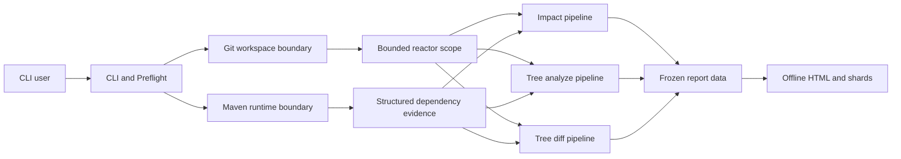

# Architecture: Dependency Analysis Pipelines

## Summary

三个 CLI 用户目标共享 repository scope、Maven runtime、workspace 和离线 Report 基础设施，但保持各自的数据语义与 publication schema。`impact` 按 Module 构建 Call Graph 并追踪变化证据；`tree analyze` 处理单侧 occurrence；`tree diff` 对双侧 occurrence 配对。后续修改必须保持 CLI orchestration 向内部机制的单向依赖，禁止让 Maven Plugin 或 Report 前端反向拥有分析领域语义。

## Structure

CLI 负责参数、Preflight、退出码和 command 生命周期。Workspace boundary 解析 Git baseline、target 或当前工作区，并把入口 POM 限制在用户选择的 bounded reactor scope。

Maven boundary 使用 [Maven Runtime](../implementation/maven-runtime.md) 执行编译与结构化依赖证据采集。Analyzer 将证据转换为 command-scoped immutable domain input；Maven Plugin 不参与 Call Graph、依赖差异或 Report 语义判断。

Analysis boundary 分成三条 pipeline：[Dependency Impact Analysis](../features/dependency-impact-analysis.md)、[Repository Dependency Tree Report](../features/repository-dependency-tree-report.md) 和 [Repository Dependency Tree Diff](../features/repository-dependency-tree-diff.md)。它们可以复用 scope 与 evidence，但不共享会丢失 occurrence、side 或 Module ownership 的领域模型。

Publication boundary 只消费冻结结果，通过 [Report Generator](../implementation/report-generator.md) 写入 callback shard 与 HTML。Report 前端不重新推导 Maven resolution、Call Graph 或 impact classification。

## Architecture Diagram

Git 与 Maven process 只向 Analyzer 返回 bounded workspace 和结构化 evidence。三条分析 pipeline 在 publication 前保持独立领域语义，最终只通过冻结的数据 schema 进入离线 Report。

## Architecture Decision Records

- None.

## Runtime Flow

1. CLI 解析公共参数并执行 command-specific Preflight；失败时不启动分析，也不替换旧 Report。
2. Workspace boundary 准备单侧或双侧 snapshot，scope resolver 以入口 POM 建立 bounded reactor inventory。
3. Maven boundary 根据 pipeline 规划 target compile 和 dependency evidence collection；所有中间产物位于 command-owned cache。
4. `impact` 对版本变化的 logical artifact pair 进行 bytecode diff、per-Module Call Graph、evidence binding 和 reverse query；两条 tree pipeline 保留 dependency occurrence 与 side identity。
5. 每个 pipeline 冻结自身 schema 后增量或原子发布离线 Report；Console Diagnostic 与显式 topology JSON 不混入 HTML schema。
