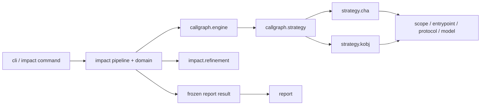
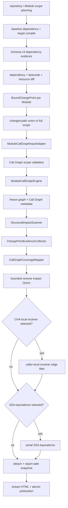

# Architecture: Dependency Analysis Pipelines

## Summary

Root CLI 分发 `impact` 与 `tree`。`impact` 只编译 target，并为每个 relevant Module 构建一张 selected Call Graph；baseline 提供 dependency evidence 与 old artifact。默认组合为 `cha + changed-paths + jdk-model none + result refinement none`。`k-obj` 是显式选择的实验性 algorithm。

Relevant Module 按 stable key 串行。当前 Module 完成 Call Graph、evidence、Impact Query、optional refinement、diagnostics 与 report-safe snapshot 后，才进入下一个 Module。`tree` 保持独立 dependency-report pipeline；两者只共享 runtime、workspace 与 task cache 基础设施。

## Package Dependency Direction

禁止反向边：`callgraph.. -> impact..`、`callgraph.. -> report..`、`report.. -> strategy.cha..|strategy.kobj..`。CHA 与 `k-obj` implementation 不互相引用；公共 protocol 不依赖 strategy 或 engine。

## Impact Flow

## Call Graph Boundary

- `ModuleCallGraphInput` 只携带 module label、class directory、artifact coordinate、scope/body policy、change selector 与 protocol fact。
- Call Graph engine 不接收 `ModuleAnalysisUnit`、`BoundChangePoint` 或 `ModuleChangedPathSelection`。
- `CallGraphBuildContext` 保存公共 WALA 构建数据；`ChaCallGraphRequest` 与 `KObjCallGraphRequest` 保存各自配置。
- Engine 只输出 graph/session、stats、capability、typed protocol limitation、scope warning、boundary finding 与 optional topology。
- `PerModuleImpactPipeline` 在构图完成后采集 structural/reference evidence。`CallGraphCoverageMapper` 是 Call Graph finding 到业务 coverage reason 的唯一转换点。
- Report 只消费 detached immutable snapshot，不读取 live graph、hierarchy、cache 或 concrete strategy。

## Module Contract

- Reactor root：target reactor 执行一次 `mvn compile`；active Module 独立分析。
- Leaf Module：从所属 reactor root执行 `-pl <path> -am compile`，只报告当前 Module。
- 当前 Module classes 为 `PROJECT`；上游 reactor Module 为 `REACTOR_DEPENDENCY`；外部 selected artifact 为 `DEPENDENCY`；target JDK 为 `JDK`。
- Entrypoint class 只来自当前 Module classes index。Scope、hierarchy、cache 和 Call Graph 均为 per-Module。
- Requested dependency scope 与 actual scope 分开保存。无法稳定恢复完整 changed path 时，只对当前 Module fallback 到 `full`，并生成 typed warning。

## Algorithm and Refinement Contract

- `--call-graph-algorithm` 只接受 `cha`、`k-obj`；默认 `cha`，不自动 fallback。
- CHA 固定 `jdk-model=none`，不应用 Reflection。`k-obj` 默认 `jdk-model=jdk8`，允许显式 `none`，并应用 Reflection。
- `--k-obj-depth` 只对 `k-obj` 合法，默认 `1`。
- `--result-refinement-algorithms` 接受 `cha-local-receiver-inference`、`ssa-equivalence` 或组合，默认 `none`。
- local receiver refinement 只验证已有 CHA predecessor edge；不发现 terminal evidence、不补边、不构建第二张 graph。
- SSA equivalence 在 candidate path 形成后运行；结果类型与 normalization 位于 `impact.refinement.ssa`。

## Concurrency and Lifecycle

- Module 严格串行，避免同时持有多张 WALA graph。
- Impact Query 与 code comparison 受 `--analysis-parallelism` 的 bounded pool 控制。
- 当前 Module snapshot 写入 task cache 后释放 live WALA state。
- Diagnostics JSON 为 Schema v9；Report 和 diagnostics 都读取已冻结 metadata/evidence。
- Report 完整写入同 filesystem staging 后原子替换；失败清理 task-owned cache。
