# Architecture: Dependency Analysis Pipelines

## Summary

Root CLI 提供 global Maven/config options，将请求分发给 `impact` 或 `tree`。两条 pipeline 共用 runtime 和 preflight 数据契约，但保留独立检查图与 domain result；Tree pipeline 逐 reactor 发布 Report，不聚合保存全部 reactor result。

## Structure

- Root CLI - 解析 global options 和 subcommand，不承载分析算法。
- Maven Runtime - 选择用户 executable 或准备内嵌 Maven 3.6.3，产出只读 `MavenRuntimeDescriptor`。
- Preflight - 稳定拓扑顺序执行 check DAG，产出 console、pipeline、report 共用的 `PreflightReport`。
- Impact Pipeline - Config-owned Git workspace、JDK 8 build、GraphML dependency diff、bytecode diff、pre-seed scan、JDK scope、Call Graph、impact trace、report。
- Tree Pipeline - Git repository snapshot、POM/reactor inventory、module text collection、version analysis、repository/reactor HTML report。

## Architecture Diagram

```mermaid
flowchart LR
  Root["DependencyAnalyzerCli"] --> Runtime["Maven Runtime"]
  Root --> ImpactPreflight["impact Preflight DAG"]
  Root --> TreePreflight["tree Preflight DAG"]
  Runtime --> ImpactPreflight
  Runtime --> TreePreflight
  ImpactPreflight --> Impact["ImpactPipeline"]
  TreePreflight --> Inventory["Repository → Reactor Selection"]
  Inventory --> Mode{"rootSelected?"}
  Mode -->|yes| Full["all activePoms execution scope"]
  Mode -->|no| Bounded["-pl requested -am execution scope"]
  Full --> MavenTree["Maven verbose tree"]
  Bounded --> MavenTree
  MavenTree --> ResultFilter["Module result selection"]
  ResultFilter -->|exclude pure aggregator| Occurrence["DependencyOccurrence"]
  Occurrence --> Page["Atomic Reactor Page"]
  Page --> Checkpoint["RUNNING/SUCCESS/COMPLETED_WITH_ISSUES/FAILED Index"]
  Impact --> ImpactReport["HTML / Markdown Report"]
```

## Key Terms

- `PreflightResult` - 单个 check 的 scope、requirement、status、decision、evidence、fallback 和 elapsed time。
- `MavenRuntimeDescriptor` - runtime source、executable、version、Java home、config dir 和 distribution SHA-512。
- `ReactorDescriptor` - repository 内一个 reactor root、完整 `activePoms`、path direct-match `requestedPoms` 与 `rootSelected`；execution scope 与最终 Module result set 不等价。
- `DependencyOccurrence` - selected/omitted dependency path 上的完整 version、scope、optional 和 mediation evidence。
- `Version evidence` - `managedFrom` 表示 management 覆盖前值，effective 表示 management 后 node 值，selected 表示 conflict resolution 最终值；pipeline 不推断 management 来源 POM/BOM。
- `ReactorReportSummary` - 已发布 reactor 的轻量 Index checkpoint 数据，不引用 module/occurrence result。

## Architecture Decision Records

- Command Preflight 是 pipeline 启动 decision source；Reactor model、Maven collection 和 evidence failure 属于 Analysis issue，不再伪装成 Reactor Preflight。
- Command-level `REQUIRED` failure 阻断整个 command；Analysis 中某 reactor failure 不阻止其他 reactor page 发布。
- `tree` 以 Maven dependency plugin text + standard tokens + verbose 为 canonical input，以兼容多个 plugin version。
- Scope filter 在 parser 边界应用，后续 tree、统计和 version analyzer 只消费同一 occurrence 集合。
- `dependencyManagement` 只通过实际 resolved occurrence 的 verbose annotation 进入 pipeline；完整 managed entry/BOM inventory 和 management 来源定位不属于 Tree analysis contract。
- Module conflict 比较实际 dependency path requested version 与实际应用的 dependencyManagement effective version；跨 Module conflict 仍只使用 selected resolved version 判定。Internal conflict 位于 Module tab，cross-module conflict 位于 Reactor-level section；management evidence 不伪造 dependency chain。
- Tree full inventory、Maven execution scope 与 Module result selection 分离：root-selected 使用全部 `activePoms` 建立真实 reactor context，child-only 使用 `-pl/-am`；packaging 为 `pom` 且存在 active child 的纯 aggregator root 保留 execution，但不生成 Module result。Report 只展示产生 result 的 full-reactor module，或 bounded mode 的 requested 与 scoped same-reactor dependency closure。
- Renderer 直接从 occurrence 生成 Maven-style verbose `<pre>` tree；tree 是无交互证据。Index table 与 Reactor/Module conflict component 只消费轻量 summary 或当前 reactor result，不改变 selection contract。
- Reactor page 必须先于 Index checkpoint 发布；完成后完整 reactor result 不再由 command/session 持有。

## Runtime Flow

- `impact`：global options → JDK 8/runtime/workspace Preflight → build → GraphML diff → bytecode diff → exact seed scan → 零 seed直接返回，或 JDK scope → CHA/RTA → impact → method evidence → report。
- `tree`：global options → command snapshot/runtime/full-inventory Preflight → `RUNNING 0/N` → 每 reactor Maven/parser/analyzer/issue → atomic page → atomic Index checkpoint → summary → `SUCCESS`/`COMPLETED_WITH_ISSUES`/`FAILED`。
- Preflight 创建的 snapshot、workspace、command tmp 和 runtime metadata 通过 `PreflightContext` 交给 pipeline；workspace/tmp 按 subcommand UUID run 隔离并由 owner 在 `AutoCloseable` 路径清理。
