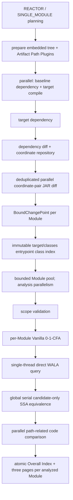

# Architecture: Dependency Analysis Pipelines

## Summary

Root CLI 分发 `impact` 与 `tree`。`impact` 面向 Maven、Spring backend、JDK 8：只编译 target，只构建 target per-Module Call Graph；baseline 仅提供 dependency tree、old artifact coordinate、old bytecode 和按需 old SSA。`tree` 保持独立 repository/reactor HTML pipeline。

## Impact Runtime Flow

## Module Contract

- Reactor root：target reactor 执行一次 `mvn compile`；全部 active、analysis-eligible Module 独立分析。
- Leaf Module：从所属 reactor root 执行 `-pl <relativePath> -am compile`；只报告当前 Module。
- 当前 Module classes 为 `PROJECT`；上游 reactor Module 为 `REACTOR_DEPENDENCY`；外部 artifact 为 `DEPENDENCY`；JDK 8 为 `JDK`。
- Entrypoint class仅由当前 Module `target/classes` index产生；interface/annotation排除，abstract class的 non-abstract declared method保留。Repeatable slash selector可缩小 roots；门禁与 Call Graph构造复用同一个 immutable index，ownership/classpath precedence不参与 root识别。
- 每个 entrypoint JVM parameter slot只使用一个 declared-type candidate；resolved interface/abstract type使用共享 synthetic placeholder，不枚举 concrete subtype或implementor。Selector与 placeholder均不裁剪 scope、CHA、Reflection、model provider或其他 origin reachability，但可能遗漏 implementation-only impact path。
- 每个 Module 拥有独立 scope、ownership index、CHA、WALA graph 和 cache。不同 Module 不共享可变 WALA 状态。

## Concurrency Contract

- baseline dependency 与 target build 两个 Maven process 并行；任一失败时取消另一 process tree。
- 两者 join 后才运行 target dependency；同一 target workspace 不并发执行两个 Maven process。
- Baseline/target dependency 使用同一内嵌 Plugin runtime、settings overlay，并在各自单个 Maven process/session 中执行 fully-qualified `tree` 与 `resolve-artifact-paths` goal；target compile 不使用 overlay。
- GraphML 是 `impact` 唯一的 mediation authority；Artifact Path Plugin 不执行第二次 collection，JSON 只为 command-scoped `IJarRepository` 提供初始化 binding。非 `system` binding 来自 Resolver result，`system` binding 来自 effective `MavenProject.systemPath`。Repository 构建后以 `ArtifactCoord` 为唯一 key，业务对象不保留 dependency JAR path。Analyzer 按 Module baseDirectory/coordinates 配对并验证 external dependency set 完全一致。Reactor dependency 不发起 artifact resolution，target 阶段映射到 `target/classes`。
- `--analysis-parallelism` 默认 `2`，分别控制 Module analysis、JAR diff 和 decompile bounded pool；各阶段再按 task 数计算 actual workers。超过 CPU 只 warning。
- JAR diff 按 logical old/new coordinate pair 去重；code comparison 按 coordinate pair/member 去重并跨 Module 复用。physical path 只存在于 repository 内部和短生命周期 `JarLease`。
- 每个 Module 内 WALA build/query 单线程；Module 之间并行。
- SSA equivalence 全局串行。
- Module 普通 failure/timeout 不取消其他 Module；global preparation failure 不替换旧 Report。
- relevant Module 未匹配用户 entrypoint selector 时为 `SKIPPED_USER_ENTRYPOINT_SCOPE`；所有 relevant Module 都未匹配时属于 command failure，不替换旧 Report。

## Failure and Publication

- JAR pair failure：关联 Module 为 `INCONCLUSIVE_BYTECODE_DIFF`；其他 pair 继续。
- Module failure：其他 Module 继续；生成 `PARTIAL_SUCCESS` 或 all-failed `FAILED` HTML Report。
- `SUCCESS`/`INCONCLUSIVE` exit `0`；`PARTIAL_SUCCESS`/`FAILED` exit `2`；参数或 Preflight failure exit `1`。
- Report 使用 staging，先写每个非-skip Module 的 Module Index、Affected Call Chains、Dependency Changes，再写 Overall Index，最后替换 command-owned output。

## Analysis Model Boundaries

- Call Graph 是 Vanilla 0-1-CFA over-approximation。
- Entrypoint fake receiver/parameter只表达 declared interface/abstract type，不探索真实 implementation；因此 implementation-only path可能不可达。
- Reflection/MethodHandle 使用 WALA `FULL`/MethodHandle extension，属于 best-effort。
- ServiceLoader 与注册的 `invokedynamic` 协议在 `makeCallGraph(...)` 前安装 WALA model，参与 points-to/call graph fixed point；构图后不允许 overlay 补图或 whole-scope JAR/classfile 重扫。
- 非 constant ServiceLoader service type、非法 provider 与 reachable unknown bootstrap 产生 stable limitation，并使 Module `INCONCLUSIVE`。
- Spring DI/AOP/annotation/XML/config、custom classloader 不完整建模。
- 只允许 `PROVEN_EQUIVALENT` 删除 Impact Paths；`UNKNOWN` 保留路径。
- Dependency Changes 只展示 candidate/final Impact Path 或 Structural Reference Path 关联 member；SSA-filtered candidate 仍保留调用链和 decompiled code evidence。
- “无路径”只表示在声明的 analysis model 内未发现 Impact Path。
