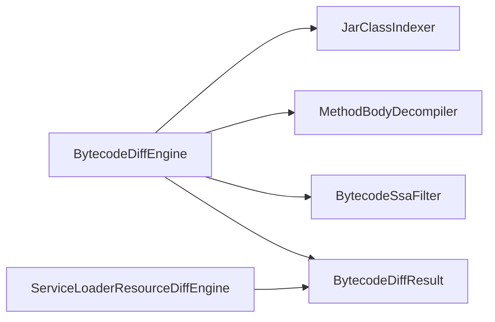

## Overview

Bytecode Diff 的内部实现把 class 结构比较、方法体等价判断和资源注册比较分开。它将单个依赖版本对转换为有效[变化点（Change Point）](../../glossary/change-point.md)及比较证据，供父组件对外返回。

## Code Structure

结构入口位于 `analyzer/src/main/java/io/github/dependencyanalysis/bytecode/BytecodeDiffEngine.java`。`JarClassIndexer` 将 class 内容转换为结构索引，使 class、成员、描述符和访问权限比较不依赖 JAR 条目顺序。

方法体变化采用两阶段过滤。`MethodBodyDecompiler` 先比较反编译后的 Java 文本；文本相同即抑制候选。其余候选交给 `BytecodeSsaFilter` 比较规范化的 Static Single Assignment（SSA，静态单赋值）表示；等价时抑制，不同或无法判断时保留。

`BytecodeDiffResult` 同时保存有效变化点、原始候选数量和比较证据。这样调用方能解释候选被抑制的原因，避免把“无法判断”等同于“没有变化”。`BytecodeDiffEngineTest` 覆盖结构变化与语义过滤。

`ServiceLoaderResourceDiffEngine` 比较服务注册资源，独立于 class 索引；两个入口的结果由调用方合并，而非由结构索引器解释资源语义。

## State and Data

每次 diff 在同一资源作用域内打开 old/new `JarLease`；正常返回或异常退出均关闭已打开的租约。结果保存领域值和比较证据，不保存 live `JarFile` 句柄。

## Boundaries

本页覆盖 `bytecode` 内结构索引、语义过滤与资源差异的组织；不负责跨模块任务去重、失败归并、业务路径追踪或报告发布。
