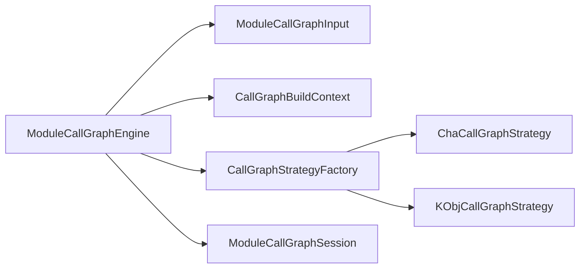

## Overview

Call Graph Engine 将构图装配、算法选择与查询会话分开。不可变模块输入经统一入口构建后，产生包含调用关系、类归属和算法证据的会话，供父组件交给当前模块的查询方。

## Code Structure

统一入口位于 `analyzer/src/main/java/io/github/dependencyanalysis/callgraph/engine/ModuleCallGraphEngine.java`。它准备分析范围、类层次与业务入口，再通过 `CallGraphBuildContext` 向策略传递构图资源。构图超时预算包含前置准备的耗时；准备阶段耗尽预算也应判为超时。

`CallGraphStrategyFactory` 将算法标识映射为 Class Hierarchy Analysis（CHA，类层次分析）策略或实验性的 `k-obj` 策略。策略放在独立 package，共享输入与结果契约；这种隔离受[包边界规则](../../rules/package-boundaries.md)和 `PackageArchitectureTest` 约束。

`ModuleCallGraphSession` 组合 live graph、类层次、分析范围与冻结的 metadata。metadata 保存算法、入口统计和模型限制，避免下游依赖具体 strategy 类型；可选 topology 统计不意味着每次构图都生成完整的拓扑快照。

## Contract

入口接收模块输入、入口索引和非负超时。没有可用业务入口、构图超时或算法失败时抛出类型化 `CallGraphException`；该组件不把失败转换成业务分析状态。

## State and Data

会话不是 `AutoCloseable`，没有显式 `close()`。它在当前模块查询期间持有 WALA 对象；调用方需在发布前复制所需数据并移除会话引用。引用不再可达后由 Java 回收对象，不能把“结果已冻结”描述为已显式关闭 WALA 资源。

## Boundaries

本页覆盖 `callgraph.engine` 与 `callgraph.strategy` 的构图组织；不定义变化点绑定、业务证据、影响分类或报告投影。
