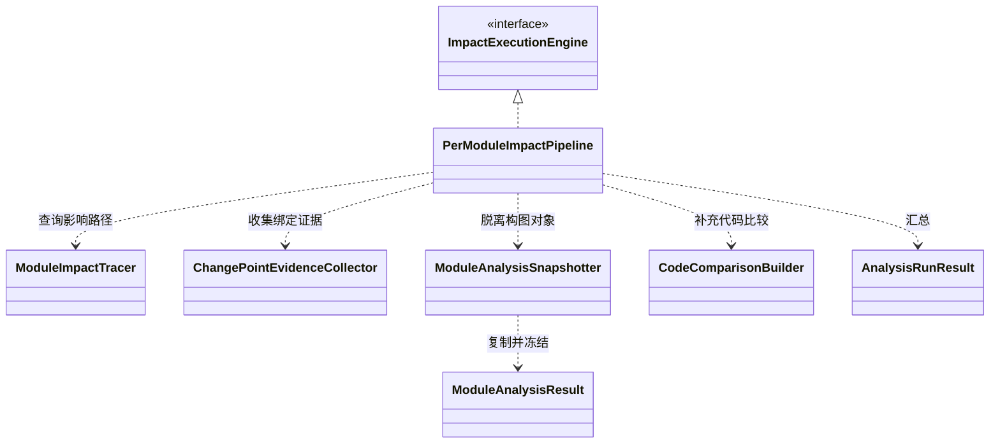

## Overview

Impact Tracing 把命令编排、模块路径查询和结果冻结分成不同职责。两侧依赖与目标侧编译结果经分析后形成 `AnalysisRunResult`，让父组件在局部失败时仍能交付带状态和限制的可用结果。

## Code Structure

命令编排位于 `analyzer/src/main/java/io/github/dependencyanalysis/impact/PerModuleImpactPipeline.java`。它为 baseline 解析依赖，为 target 构建业务输出，并按逻辑 artifact pair 共享字节码差异。单个 pair 失败保留关联模块的诊断，全局准备失败向上传播。

`ChangePointEvidenceCollector` 将[变化点（Change Point）](../../glossary/change-point.md)与可定位证据关联；`ModuleImpactTracer` 基于这些证据反向查询业务入口。证据定位和路径选择分离，避免把成员存在、结构引用和实际可达路径混为同一种结论。

`ModuleAnalysisSnapshotter` 是分析对象进入报告结果前的隔离边界。它把 WALA 查询节点转换为 `SnapshotQueryNode`，将方法证据锚点转换为稳定身份，复制指标后清除 `ModuleAnalysisResult` 的 session 引用。单纯清除顶层 session 不足以隔离图对象，路径与证据中的引用也必须转换。

`CodeComparisonBuilder` 为需要解释的影响路径生成代码比较。比较结果在模块查询完成后汇总；`PerModuleImpactPipelineTest` 约束路径选择和覆盖不足时的状态。

## State and Data

一次 `run(...)` 使用命令级公共线程池。依赖差异与模块查询共用本次分析的 JAR repository；作用域结束时关闭 repository，`finally` 清除 pipeline 持有的引用。

报告缓存由命令提供，供分析与发布阶段共享；它不属于单个模块。冻结后的路径、状态和证据不再依赖 live Call Graph，会话脱离后仍可用于报告。

## Invariants

- 逻辑坐标和成员身份用于归并；物理 JAR 路径和源码行号不充当稳定主键。
- 并发完成顺序不得改变最终模块、变化点和代表路径的稳定顺序。
- [覆盖限制（Coverage Limitation）](../../glossary/coverage-limitation.md)说明哪些范围无法确认；缺失必要证据不能伪装成成功的空结果。

## Boundaries

本页覆盖 Impact 内的编排、证据、查询与冻结边界；不定义外部组件的字节码算法、构图策略或 HTML schema。
