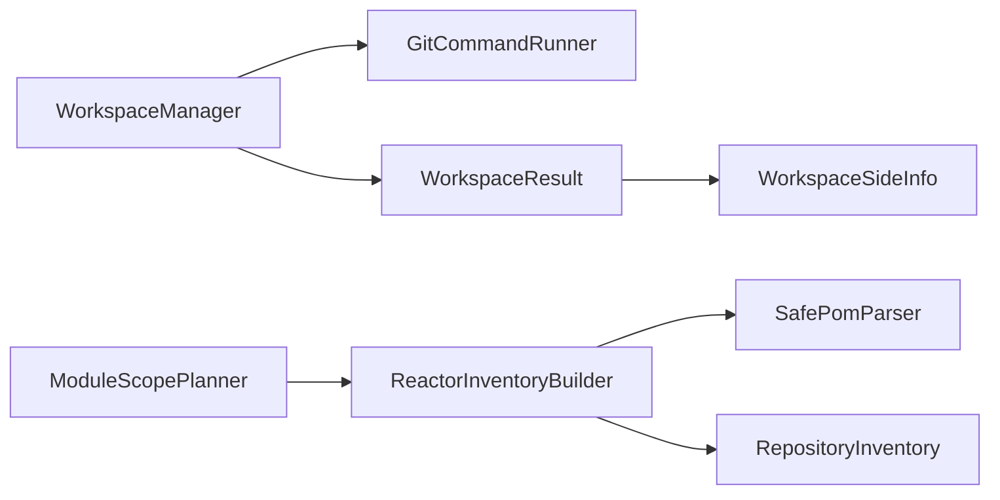

## Overview

Workspace Scope 内部分别管理 Git 快照资源与 Maven 模块范围。前者提供 baseline/target 的路径和版本身份，后者确定入口实际拥有的模块，使父组件能交付受限的构建与分析输入。

## Code Structure

快照所有者位于 `analyzer/src/main/java/io/github/dependencyanalysis/workspace/WorkspaceManager.java`。它登记自身创建的临时目录，通过 `GitCommandRunner` 创建 detached worktree；`WorkspaceSideInfo` 保存路径、commit 和 dirty 信息。target 缺省时引用当前工作区，显式 ref 则创建隔离快照。

`reactor/ReactorInventoryBuilder` 根据入口 POM、激活条件与祖先聚合项目计算[受限 Maven 范围（Bounded Maven Scope）](../../glossary/bounded-maven-scope.md)，`SafePomParser` 提供安全的声明读取。模块集合由 Maven 归属决定，不能把整个 Git repository 当作一个 reactor。

`impact/ModuleScopePlanner` 将 inventory 转换为 Impact 使用的执行计划；虽然位于 `impact` package，其职责是范围适配。`ModuleScopePlannerTest` 交叉验证入口和模块选择契约。

## State and Data

`prepare(...)` 失败时尝试清理已创建的临时 worktree。`close()` 可重复调用，按登记集合清理 worktree 及临时 parent；清理失败记录诊断，不能保证磁盘资源必然删除。

当前工作区不属于临时清理集合。关闭后已复制的 commit、dirty 信息可用于报告，但临时 worktree 路径不能再作为有效分析输入。

## Boundaries

本页覆盖快照所有权和 Maven 范围规划；不负责依赖解析、业务分析或报告缓存清理，不执行远程 fetch 或切换用户 checkout。
