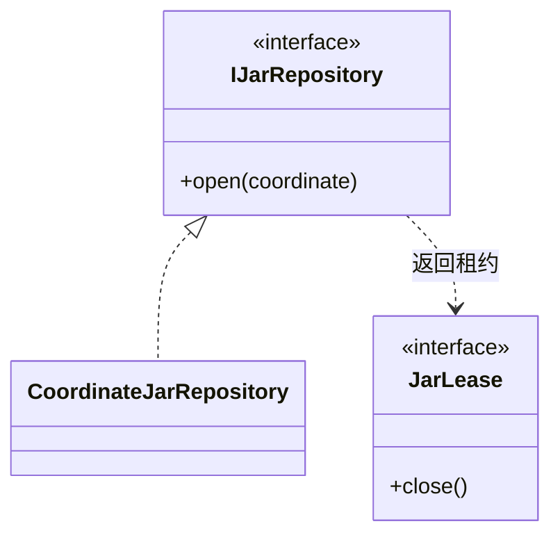

## Overview

Artifact Repository 管理 Maven 逻辑坐标到物理 JAR 的绑定，为 CLI 分析提供可并发打开、可追踪关闭的短期文件租约。

## Responsibilities

- 以稳定排序消解同一坐标的多个候选绑定。
- 对每个使用方暴露短生命周期 `JarLease`；repository 关闭后拒绝新租约。
- 阻止物理路径进入依赖变化点或 Report 的稳定身份。

## Interfaces

- `IJarRepository`：按逻辑坐标获取租约；坐标未绑定、文件不可用或 repository 已关闭时明确失败。
- `JarLease`：在 close 时释放并注销实际 `JarFile` handle。

## Code Mapping

逻辑坐标到物理文件的绑定由 `jar/CoordinateJarRepository` 负责；调用者通过接口取得短期租约，避免持有未受管理的文件句柄。

## State and Data

同一坐标的路径先规范化、去重，再按字典序选择第一个；多个候选产生警告。构造时校验选定文件可作为 JAR 打开，行为由 `CoordinateJarRepositoryTest` 约束。

Repository 关闭时释放所有未关闭的租约，并拒绝后续打开操作；已复制的分析结果不依赖这些文件句柄。

## Boundaries

该 Component 负责已解析 artifact 的位置与 handle ownership；不执行 Maven resolution、不缓存跨 command JAR handle，也不决定 bytecode 或 Call Graph 语义。
