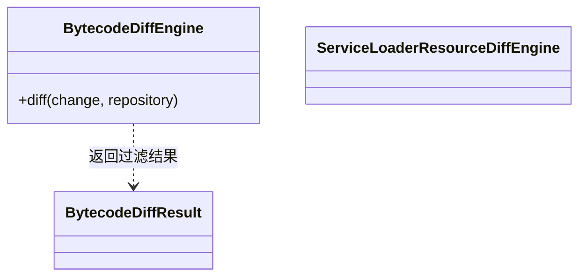

## Overview

Bytecode Diff 将版本发生变化的逻辑 artifact 对转换为 [Change Point](../../glossary/change-point.md)，即经过语义过滤后仍需追踪的 class、member、method body、JVM access 或 ServiceLoader 变化身份。

## Responsibilities

- 对一个逻辑 old/new pair 生成稳定差异；跨模块复用和单个 pair 的失败隔离由 [Impact Tracing](dependency-analyzer-cli-impact-tracing.md) 编排。
- 先比较 Vineflower 生成的 Java text，再以 normalized Static Single Assignment（SSA，静态单赋值）处理剩余 method body candidate。
- 合并 class removal 与 ServiceLoader registration 变化，并生成稳定的 ChangePoint identity。

## Technology

- ASM 9.7：读取并比较 JVM class 结构与指令。
- Vineflower 1.12.0：生成 method body 的 Java text comparison evidence。
- WALA 1.8.0：生成 normalized Static Single Assignment（SSA，静态单赋值）比较结果。

## Interfaces

- Artifact-pair diff：输入 logical coordinate pair 与 leases；输出稳定排序的 effective ChangePoint、comparison evidence 与 pair failure。
- Method-body filtering：Java text 或 SSA 等价时抑制 candidate；`DIFFERENT` 或 `UNKNOWN` fail-open 保留。

## Code Diagram

单个依赖版本对的结构与方法体比较由 `bytecode/BytecodeDiffEngine` 提供；ServiceLoader 注册资源由独立入口比较，调用方合并结果。

内部组织见 [Bytecode Diff Code](../code/dependency-analyzer-cli-bytecode-diff.md)。

## State and Data

Pair-local comparison 可跨 Module 复用；反编译源码只进入当前 command report cache，且不写入 Report schema。

## Boundaries

该 Component 负责变化事实与等价过滤；不构建业务 Call Graph、不选择 affected path，也不以 physical JAR path 定义变化身份。
