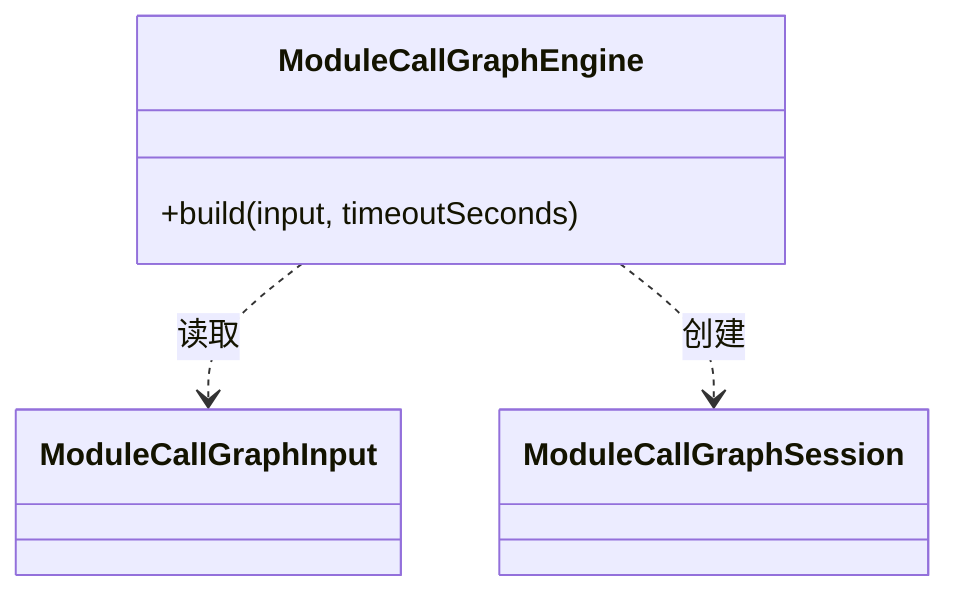

## Overview

Call Graph Engine 根据模块输出和依赖 classpath 构建调用图，为 CLI 提供当前模块可查询的会话与构图证据。模型无法完整覆盖的范围以[覆盖限制（Coverage Limitation）](../../glossary/coverage-limitation.md)保留。

## Responsibilities

- 建立 class hierarchy、canonical class ownership、entrypoint set 与 dependency body boundary。
- 隔离正式 Class Hierarchy Analysis（CHA，类层次分析）与实验性 `k-obj` strategy。
- 在 graph build 完成后提供只读查询 session，并在 Module finalization 时冻结报告所需结果。
- 将 timeout 转换为当前 Module 的 handled failure。

## Technology

- WALA 1.8.0：承载 Class Hierarchy Analysis（CHA，类层次分析）与实验性 `k-obj` 构图。

## Interfaces

- 模块输入 `ModuleCallGraphInput`：提供业务 class 目录、reactor 依赖目录、目标 artifact、依赖方法体范围及相关变化；入口选择与算法配置由 engine 持有，入口索引和 timeout 通过 `build(...)` 传入。
- 构图结果 `ModuleCallGraphSession`：提供 live graph 与冻结的指标、类型化限制、边界和算法 metadata；拓扑统计按需采集。查询方按只读契约使用会话。

## Code Diagram

构图入口 `callgraph/engine/ModuleCallGraphEngine` 接受模块输入，返回供当前模块查询的会话；调用方不直接创建具体算法策略。

内部组织见 [Call Graph Engine Code](../code/dependency-analyzer-cli-call-graph-engine.md)。

## State and Data

Call Graph session 在构图、证据收集和路径查询期间持有 WALA hierarchy 与 graph。调用方完成查询后，通过 [Impact Tracing Code](../code/dependency-analyzer-cli-impact-tracing.md) 中的结果冻结边界移除 live session 引用；冻结结果仍可用于报告。Class ownership 对每个 binary class 只选择一个 canonical winner。

## Boundaries

该 Component 只提供算法中立图结果；不依赖 Impact 或 Report package，不绑定变化点，也不执行业务路径 classification。
