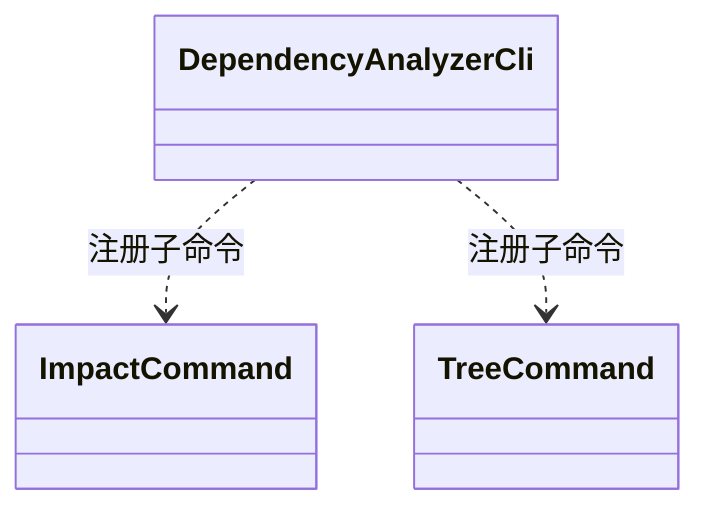

## Overview

Command Control 管理公共命令、分析前检查与诊断生命周期，将用户参数转换为已校验的执行请求，并向 CLI 返回明确的命令状态。

## Responsibilities

- 在分析副作用前验证 option 组合、filesystem、Git、JDK、Maven 与 output contract。
- 由公共 output directory 校验统一 Impact 与 Tree 的路径规范化、目录创建前检查和普通文件拒绝语义。
- 以稳定 Stage、substage 和 identity 输出低成本 Diagnostic，并按 verbosity 控制高成本 evidence。
- 将 handled Module failure 与 command-level failure 分离。

## Technology

- Picocli 4.7.6：定义 CLI command、option 与参数校验边界。
- Java structured diagnostics：输出可关联的运行阶段、进度与失败证据。

当前程序诊断遵循自身日志级别；第三方输出只附加操作来源，实时写入控制台，不重新解释其日志级别。详细处理约束见[运行证据规则](../../rules/operational-evidence-design.md)。

## Interfaces

- Root 与 subcommand contract：参数解析失败或 Preflight 阻断返回 `1`，不启动 pipeline。
- Diagnostic contract：每个物理行使用稳定五段 prefix；敏感 settings、credential 与未过滤参数不得进入输出。

## Code Diagram

根入口 `cli/DependencyAnalyzerCli` 注册 Impact 与 Tree 命令。命令解析、分析前检查和诊断各有独立职责，修改公共参数时须同步[用户手册维护规则](../../rules/user-manual-maintenance.md)；诊断遵循[运行证据规则](../../rules/operational-evidence-design.md)。

## State and Data

Runtime Metrics scheduler 与 Diagnostic context 只属于当前 command；关闭 command 时终止，不影响结果状态。

## Boundaries

该 Component 负责控制流入口和运行证据；不拥有 Git worktree、Maven execution、分析算法或 HTML schema。
