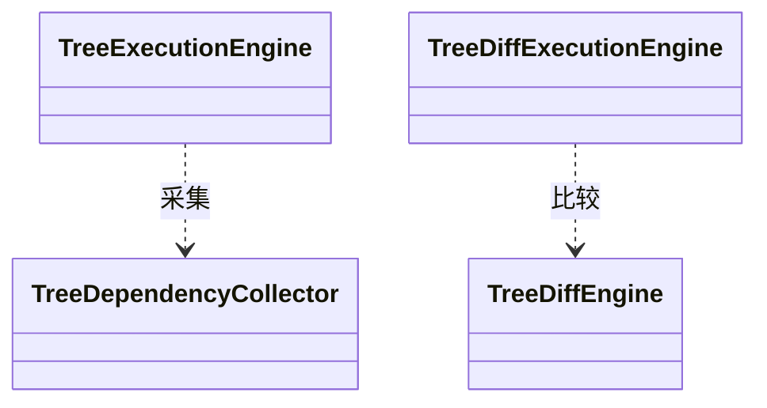

## Overview

Dependency Trees 将单侧依赖证据整理为解析视图，或比较两侧结构兼容的项目快照，为 CLI 提供保留依赖出现位置与版本侧身份的树分析结果。

## Responsibilities

- 聚合 requested/resolved version、scope、directness、resolution source 与 dependency path。
- 按 canonical classpath precedence 识别 internal/external class conflict。
- 在 Tree Diff 中先配对 Reactor/Module structure，再按 DependencyKey 与 PathKey 分类变化。

## Interfaces

- Tree Analyze：输入一个 bounded snapshot；输出 Repository、Reactor、Module 与 conflict results。
- Tree Diff：输入 baseline 与 target snapshot；结构不一致时输出 `STRUCTURE_MISMATCH`，不推导整 Module 全量 dependency 变化。

## Code Mapping

单侧分析入口是 `tree/TreeExecutionEngine`；双侧编排由 `TreeDiffExecutionEngine` 承担，依赖变化分类集中在 `TreeDiffEngine`。两种入口共享采集事实，双侧比较保留独立领域模型。

## State and Data

Result 保留每个 occurrence 和 side 的 immutable identity；已完成 Reactor 可独立进入 publication，不依赖其他 Reactor 成功。

## Boundaries

该 Component 负责 Tree domain；不执行 bytecode 变化点分析或 Call Graph，不把 Impact 的 flattened artifact-pair semantics 用于 Tree Diff。
