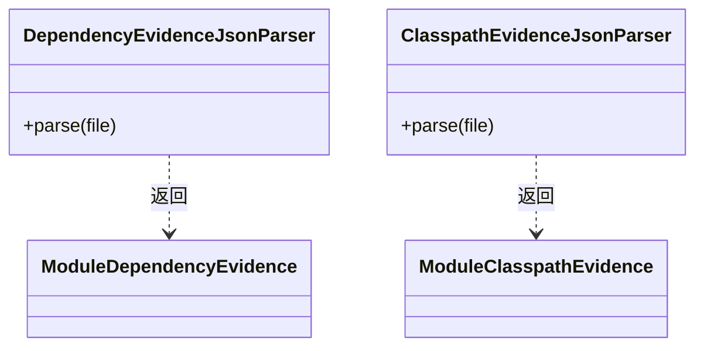

## Overview

Evidence Ingestion 校验 Plugin 发布的完整 JSON 证据，将依赖解析和 classpath 事实转换为 CLI 的 Impact 或 Tree 领域输入。

## Responsibilities

- 校验 schema、Module owner、coordinate、path boundary 与 resolved artifact existence。
- 为 Impact 保留 selected graph 与 artifact binding；为 Tree 保留 occurrence、scope、directness 和 resolution source。
- 隔离每个 Module 的 evidence failure，禁止半成品冒充完整结果。

## Interfaces

- Impact evidence：输出 logical dependency tree 与 resolved artifact binding。
- Classpath evidence：输出 occurrence-aware graph、classpath order 与 Module ownership；缺少 winner 或 owner mismatch 时失败。

## Code Mapping

Impact 的 `dependency/DependencyEvidenceJsonParser` 与 Tree 的 `tree/ClasspathEvidenceJsonParser` 分别验证并转换证据格式；两者保留各自领域需要的事实。

## Boundaries

该 Component 只规范化外部 evidence；不运行 Maven、不执行 dependency diff、Call Graph 或 class conflict classification，也不从 Console 文本补猜缺失事实。
