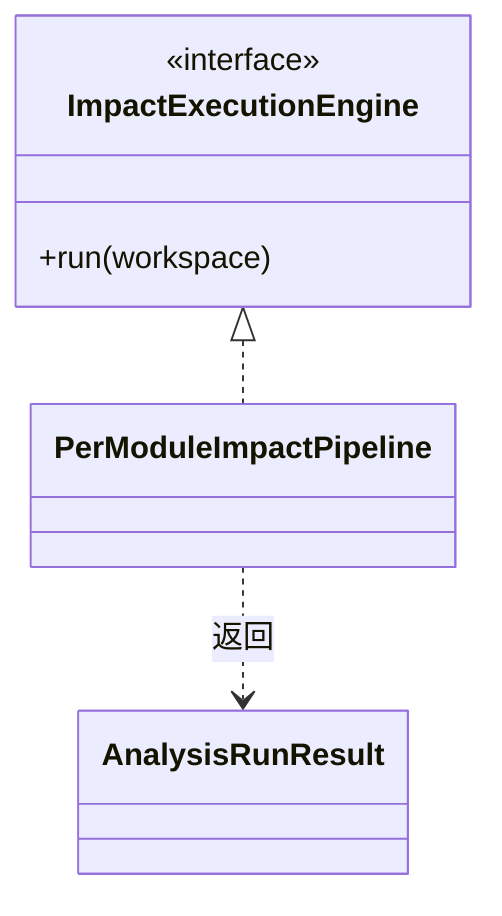

## Overview

Impact Tracing 将已确认保留的[变化点（Change Point）](../../glossary/change-point.md)与结构证据绑定为查询起点，再反向追踪到业务入口。它为 CLI 提供模块状态、影响路径及覆盖限制。

## Responsibilities

- 比较两侧 resolved dependency，选择 `VERSION_CHANGED` logical artifact pair。
- 聚合 bytecode、structural reference、dynamic protocol 与 JVM access evidence，构造 stable QueryNode。
- 在只读 topology 上执行 reverse traversal、CHA caller-local pruning 与代表路径选择。

## Interfaces

- Impact execution：输入 baseline/target scope、selector 与 command-wide graph policy；输出 Module status、dependency change、affected path 和 limitation。
- Query contract：以 logical artifact、member identity 与 Module ownership 绑定 seed；source line 和 physical path 不参与主键。

## Code Diagram

执行接口 `impact/ImpactExecutionEngine` 隔离命令层与具体编排；`PerModuleImpactPipeline` 汇总模块结果，返回报告可消费的分析结果。

内部组织见 [Impact Tracing Code](../code/dependency-analyzer-cli-impact-tracing.md)。

## State and Data

多个 Module 与 QueryNode 可并行；stable sorting 与 strongly connected component 收敛保证结果不依赖调度顺序。

## Boundaries

该 Component 负责 Impact domain 与路径解释；不修改 Call Graph topology，不把 flatten dependency diff 复用于 occurrence-aware Tree Diff，也不证明运行时一定故障。
