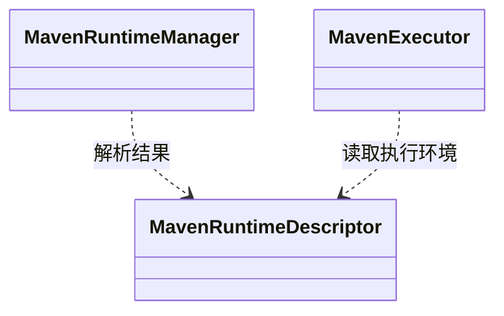

## Overview

Maven Runtime 选择 Maven executable、Java home、settings 与内嵌 Plugin repository，在限定模块范围内执行构建和证据采集，为 CLI 返回运行结果与证据位置。

## Responsibilities

- 验证 Maven `3.6.3 <= version < 4.0.0` 与实际 Maven JVM。
- 保留 user/global settings、mirror、proxy、server、profile 和 local repository 语义，并仅追加 command repository。
- 根据 [Bounded Maven Scope](../../glossary/bounded-maven-scope.md) 执行 compile 与 dependency evidence goals，将原生日志实时转发至控制台。

## Technology

- Apache Maven CLI：探测并执行用户选择或内嵌的 Maven 3 runtime。
- Apache Maven 3.6.3：随 Analyzer 提供最低兼容版本的内嵌 runtime。
- Maven Dependency Plugin 3.6.1：作为 repository ZIP 随包交付并参与证据采集。

## Interfaces

- Runtime descriptor：一次解析后供 scope resolver 与全部 Maven stage 共用；缺失 executable、非法版本或损坏 embedded artifact 时停止 command。
- Build execution：接受 immutable scope plan 与安全 Maven token；返回 exit code 和 output locations。

## Code Diagram

`runtime/MavenRuntimeManager` 负责选择和校验运行环境，`MavenExecutor` 使用冻结的描述执行命令。进程启动遵循[命令解析规则](../../rules/process-command-resolution.md)。

默认配置目录为用户目录下的 `.da`；显式 `--config-dir` 仍可指定完整路径。

默认使用 Maven 原生日志级别；程序 `DEBUG` 与 `TRACE` 均映射为 Maven `-X`。用户显式传入的 `-X`、`--debug`、`-e`、`--errors` 保持有效并去重，不额外强制开启错误详情。

版本探测 stdout 作为返回数据供版本与运行环境解析；构建日志逐行转发，不缓存尾部或重放。规则见[运行证据规则](../../rules/operational-evidence-design.md)。

## State and Data

可复用 runtime cache 由 version 与 integrity identity 管理；repository overlay、temporary extraction 与 execution output 受 command owner 限制。

## Boundaries

该 Component 负责 Maven availability 与 execution mechanism；不判断 dependency semantics、不拥有用户 credential，也不把 Maven Console 文本当作完整结构化 evidence。
