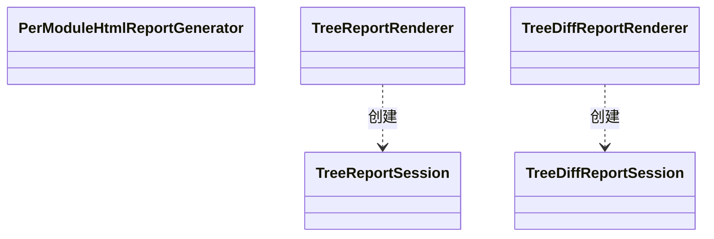

## Overview

Report Publication 将冻结的 Impact、Tree Analyze 与 Tree Diff 结果分别转换为报告数据，并为 CLI 发布可离线浏览的页面和资源。

## Responsibilities

- 保持三套 schema 的领域语义，不让 browser 重新分类分析结果。
- 生成 script-safe JSON、固定 callback signature、HTML navigation 与 lazy source shard。
- 对 Impact 执行整体原子替换，对 Tree 以 Reactor 为增量完成单元。

## Interfaces

- Frozen report input：接收已脱离 live Call Graph 引用的领域结果；报告所需路径、指标与证据必须先冻结，工作区和命令缓存可以持续到发布结束。
- Publication boundary：staging 内容通过 marker、signature 与 path 检查后提交；失败时不暴露半成品入口。

## Code Diagram

Impact 使用 `report/PerModuleHtmlReportGenerator`；Tree 的两个 renderer 位于 `tree/`，分别创建增量发布会话。修改发布边界时须同时检查入口可见性与报告完整性，不能只检查 HTML 内容。

报告保留分析结果、检查状态和简短失败原因；运行日志、子进程输出和异常堆栈只属于控制台。预检查展示检查摘要及经过确认的结构化事实（例如版本、路径和退出码），依赖路径与代码差异等分析证据继续进入报告。

## State and Data

Command report cache 可以暂存源码和 comparison evidence；成功或失败后清理，不跨 command 复用。已发布报告只包含允许的冻结 projection。

## Boundaries

该 Component 负责 projection 与 filesystem publication；不访问 live analysis session，不保存 credential、Console stack trace 或 settings 内容，也不合并会丢失语义的 schema。
