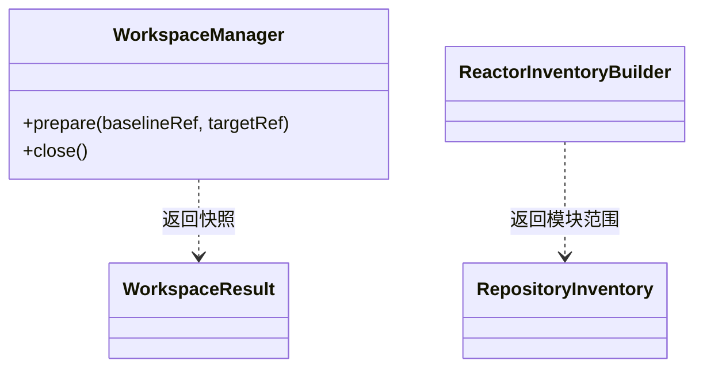

## Overview

Workspace Scope 将当前工作区或本地 ref 转换为带版本身份的快照，并以入口 POM 计算[受限 Maven 范围（Bounded Maven Scope）](../../glossary/bounded-maven-scope.md)。它为 CLI 提供每侧的快照位置和模块执行计划。

## Responsibilities

- 保留用户 checkout，按需创建 baseline 或 target detached worktree。
- 在每个 side 重新验证 Git-relative entry path、readable POM、symlink 与 repository boundary。
- 规划 `FULL_REACTOR`、`SINGLE_MODULE` 或 `STANDALONE` scope，不枚举无关 POM。

## Interfaces

- Workspace preparation：输入 repository path、side 和可选 local ref；输出带 owner identity、commit 与 dirty metadata 的 snapshot。
- Reactor inventory：输入 entry POM 与 Maven activation context；输出 immutable Module ownership 与 execution mode。

## Code Diagram

Git 快照生命周期由 `workspace/WorkspaceManager` 管理；Maven 模块归属由 `reactor/ReactorInventoryBuilder` 解析。范围规划与快照清理拥有不同输入和失败边界。

内部组织见 [Workspace Scope Code](../code/dependency-analyzer-cli-workspace-scope.md)。

Git 查询的 stdout 用作 commit、路径和状态数据，stderr 实时写入控制台；worktree 操作的两个输出流均实时转发。各流并发读取，避免管道阻塞；失败结果只保留操作、路径和退出码。Windows 下 Git 通过原生 `git.exe` 启动，避免 `cmd.exe` 将 `^{commit}` 中的 `^` 解释为 shell 转义符。

## State and Data

Owned worktree、run directory 和 marker 必须同时匹配 owner identity 才能清理；current workspace 的未提交修改只在其作为 target 时参与分析。

## Boundaries

该 Component 负责 snapshot 与 scope identity；不执行 remote fetch、不切换用户 checkout、不解析 dependency evidence，也不发现非祖先 aggregator。
