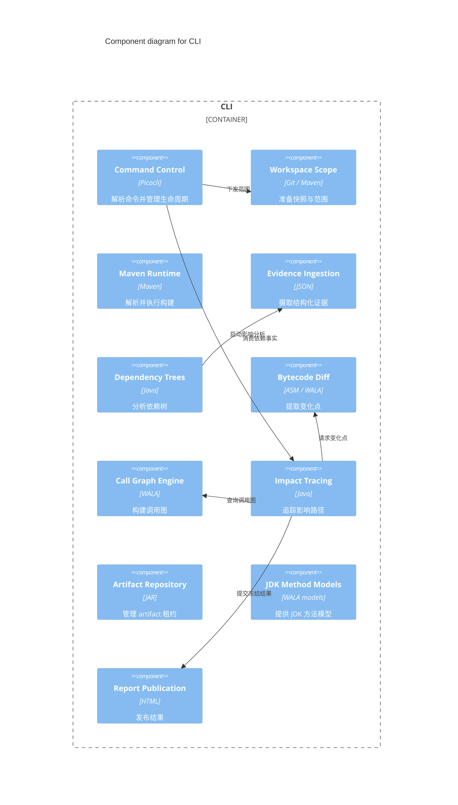

## Overview

Dependency Analyzer CLI 是本地命令行应用，协调输入校验、workspace、Maven execution、静态分析与报告发布。

## Responsibilities

- 提供 `impact`、`tree analyze` 与 `tree diff` 公共命令边界。
- 隔离 baseline、target 和 current workspace 的分析生命周期。
- 将外部证据转换为不可变的领域结果，并保留 [Coverage Limitation](../../glossary/coverage-limitation.md) 与已处理失败。

## Technology

- Java 17：运行并交付 shaded executable JAR。
- Picocli 4.7.6：提供公共命令行接口。
- ASM 9.7：读取 JVM bytecode。
- WALA 1.8.0：构建并查询 Call Graph。
- Vineflower 1.12.0：生成 method body 的反编译比较证据。

## Interfaces

- CLI：接收 repository path、local ref、Maven/JDK runtime 选择和输出位置；参数或 Preflight 失败返回 exit code `1`，且不替换既有报告。
- Report publication：输出 Impact HTML 文件，或 Tree Analyze/Tree Diff 报告目录。

## State and Data

每次 command 拥有独立 run directory、worktree、evidence cache 与 report staging；owner identity 和完成标记限制清理与发布范围。

## Component Diagram

## Boundaries

该 Container 负责分析控制面和 domain classification；不在浏览器中重新推导结果，不拥有用户 Maven repository，也不把 Dependency Evidence Plugin 的 Maven session 内部职责并入自身。
