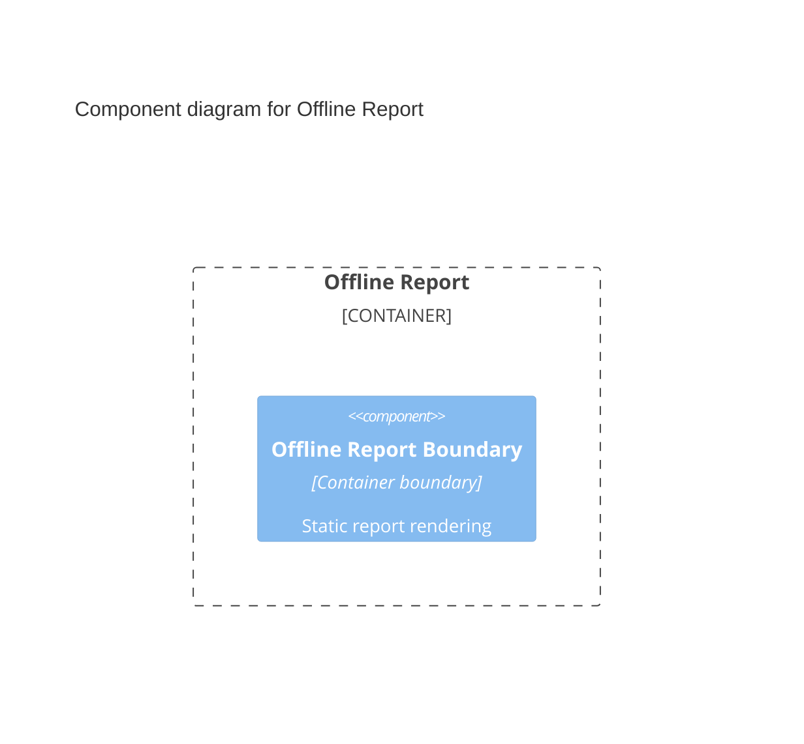

## Overview

Dependency Analyzer Offline Report 是随分析结果生成的静态浏览器应用。它通过本地 HTML、CSS、JavaScript 和按需加载的 callback shard 展示冻结的 Impact、Tree Analyze 或 Tree Diff 数据。

## Responsibilities

- 在无 HTTP server 的环境中提供 Repository、Reactor、Module、dependency diff 与 affected path navigation。
- 延迟加载大型 shard，并保持 schema identity、escaping 和 report-root 路径边界。

## Technology

- HTML：提供无需 HTTP server 的离线页面结构。
- CSS：提供报告布局与响应式样式。
- JavaScript：通过 `file://` 加载 callback shard 并驱动交互。

## Interfaces

- Local entry page：用户打开生成的 HTML；缺失资源、非法 callback 或越过 report root 的引用视为不可用报告。
- Callback shard：固定 callback signature 接收 script-safe JSON，不发起 HTTP 或 HTTPS 请求。

## State and Data

报告只读取同一 output boundary 内的冻结 shard；不会回写 Analyzer cache 或用户 project。

## Component Diagram

## Boundaries

该 Container 负责展示和本地交互；不访问 live Maven、Git、JAR 或 Call Graph session，也不重新判断 dependency resolution、impact classification 或失败状态。
