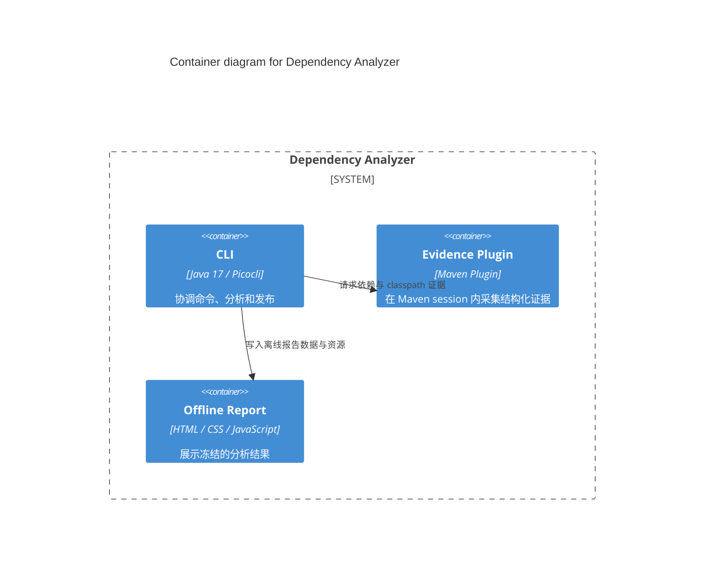

## Overview

Dependency Analyzer 帮助 [Software Developer](../actors/software-developer.md) 理解 Maven 依赖解析结果，并评估依赖升级对 Java 业务调用路径的静态影响。分析结果以明确状态和离线报告呈现，不把静态可达性解释为运行时故障证明。

## Responsibilities

- 将用户选择的 repository path 与 local ref 限制为可验证的 [Bounded Maven Scope](../../glossary/bounded-maven-scope.md)。
- 采集 dependency、classpath、bytecode 和 Call Graph evidence，并保留 [Coverage Limitation](../../glossary/coverage-limitation.md) 与失败状态。
- 发布无需 HTTP server 的 Impact、Tree Analyze 和 Tree Diff 报告。

## Container Diagram

## Boundaries

系统拥有 Analyzer CLI、配套 Dependency Evidence Plugin 与生成的 Offline Report 应用；不拥有用户项目、Git、Apache Maven、Maven repository 或浏览器，也不执行远程 Git fetch。
