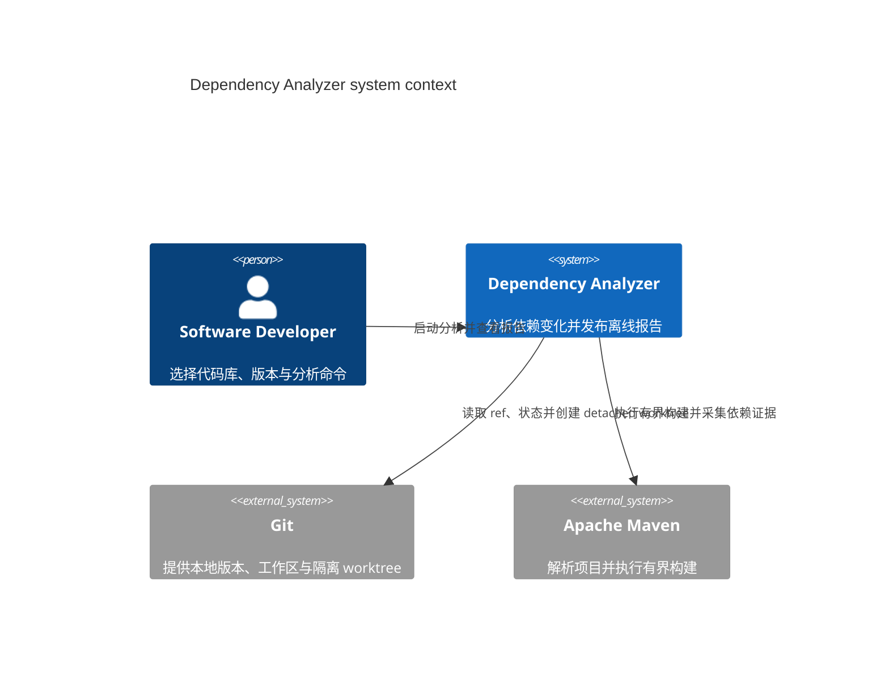

## Overview

Dependency Analyzer 面向 Software Developer，读取本地 Git repository，并通过 Apache Maven 获取依赖证据，最后生成可离线浏览的升级影响与依赖树报告。

## System Context Diagram

## Boundaries

图示只覆盖 [Dependency Analyzer](software-systems/dependency-analyzer.md) 与其直接交互的角色和外部系统。CLI、Dependency Evidence Plugin、Offline Report 及其组件属于下级 C4 页面；远程 Git 服务、Maven repository、部署节点和浏览器不在本系统上下文中。
