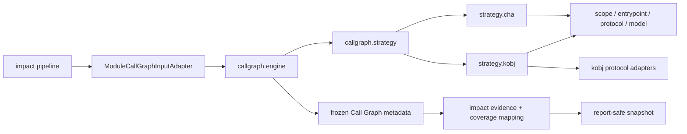

# Feature: Call Graph Engine

## Summary

Analyzer 正式支持 Class Hierarchy Analysis（CHA，类层次分析），默认 identifier 为 `cha`。`k-obj` 是显式 opt-in 的实验性 context-sensitive algorithm。CLI、日志、Diagnostics JSON 和 HTML 使用 `cha`、`k-obj`；`k-obj` 在 help、启动诊断和 Report 中标记 `experimental`。

Call Graph 层只接收自身 immutable input，输出 graph、metadata、typed limitation 与 boundary finding。它不接收 `ModuleAnalysisUnit`、`BoundChangePoint` 等 impact domain，也不绑定业务 evidence。Diagnostics JSON 保持 Schema v9 wire shape，algorithm 值域为 `cha | k-obj`。

## Package Architecture

| Package | Responsibility |
|---|---|
| `callgraph.engine` | 构图编排、input/output、session、metadata、stats、timeout、failure |
| `callgraph.strategy` | algorithm、配置、policy、capability、strategy contract、factory、公共 context |
| `callgraph.strategy.cha` | CHA graph、dispatch filtering、ancestor retention、external target pruning |
| `callgraph.strategy.kobj` | `k-obj` builder、allocation context 与固定点构建 |
| `callgraph.strategy.kobj.{invokedynamic,methodhandle,serviceloader}` | `k-obj` 专属 protocol adapter |
| `callgraph.protocol` 及子包 | 算法无关 protocol fact、resolution、limitation 与 provider index |
| `callgraph.jdk` | target JDK scope、model selection/installation、exclusion policy |
| `callgraph.entrypoint` | entrypoint selection、scanner、metrics、synthetic type registry |
| `callgraph.scope` | ownership、classpath source、scope validation 与 projection |
| `callgraph.boundary` | dependency body boundary 与 immutable finding |
| `callgraph.topology` | canonical SCC、diagnostics topology、node identity、rank、path、IR snapshot |
| `callgraph.model` | `MethodId`、`CodeOrigin` 等共享 immutable value |
| `callgraph.local` | caller-local constant recovery |

`callgraph` 禁止依赖 `impact` 与 `report`；CHA 与 `k-obj` 禁止互相依赖；公共 protocol 禁止依赖 strategy 或 engine。详见 [Package Boundaries](../rules/package-boundaries.md)。

## Input and Build Contract

`ModuleCallGraphInput` 只包含构图所需的 Module label、class directory、artifact coordinate、dependency scope/body policy、change selector 与 protocol fact。`impact` 的 `ModuleCallGraphInputAdapter` 完成业务投影。

Engine 构造 `CallGraphBuildContext`，其中只有 scope、hierarchy、entrypoint、cache、公共 protocol registry 与 monitor。算法 request 分离：

- `ChaCallGraphRequest`：ownership、changed-path dispatch、ancestor retention policy。
- `KObjCallGraphRequest`：allocation depth、Reflection、JDK model、dependency boundary。

Strategy 完成 fixed point 后返回 `CallGraphStrategyResult`。Engine 冻结 graph metrics、capability、protocol limitation、boundary metadata 与 optional topology。`PerModuleImpactPipeline` 随后执行 structural scan、`ChangePointEvidenceCollector` 和 coverage mapping。

## Algorithm Contract

### CHA

- 默认 algorithm；固定 `jdk-model=none`。
- WALA Reflection 配置不应用，Report 显示 configured value 与 not-applied 状态。
- 使用 `CHACallGraph`，Context 为 `Everywhere`。
- `changed-paths` 裁剪无关 external target，不为被裁剪调用生成 dependency boundary limitation。
- 为 PROJECT、reactor dependency 和 selected external type 传递保留 external ancestor chain；保留 reachable concrete method 的真实 IR。
- `Object.toString/hashCode` 继续使用 Diff-directed target policy。
- caller-local Class、ServiceLoader 与 MethodHandle 常量无法唯一恢复时输出 typed limitation，不猜测 target。

### k-obj

- identifier 为 `k-obj`，必须显式选择；无需额外 enable flag。
- 默认 allocation depth 为 `1`，`--k-obj-depth` 只对该 algorithm 合法。
- 默认 `jdk-model=jdk8`，允许显式 `none`。
- 应用选定 WALA ReflectionOptions。
- 使用 allocation-string Context 与 fixed-point builder；MethodHandle、ServiceLoader、`invokedynamic` adapter 只位于 `strategy.kobj` 子包。
- 属于实验性能力，可能显著增加时间与内存。

## Protocol and Boundary Contract

- `protocol.invokedynamic` 保存 bootstrap model、registry、resolution 与 dynamic evidence。
- `protocol.methodhandle` 保存 caller-local fact/result contract；`LocalMethodHandleFactResolver` 不属于具体 algorithm。
- `protocol.serviceloader` 保存 provider index、resource module 与 contract resolution。
- `boundary` 只返回 Call Graph DTO，不创建 `DependencyBoundaryEvidence` 等 impact 类型。
- `ModelLimitation`、scope warning 和 boundary finding 使用 Call Graph typed code；`CallGraphCoverageMapper` 统一转换成业务 `ModuleAnalysisReason` 与 evidence。

## Entrypoint, Scope and Topology

- Entrypoint 只来自当前 Module `target/classes` immutable index；interface、annotation、private nested class和 private/abstract method不作为 root。
- 每个 JVM parameter slot使用一个 declared-type candidate；interface/abstract reference使用共享 synthetic placeholder。
- ownership precedence 为 `JDK > PROJECT > REACTOR_DEPENDENCY > DEPENDENCY`，duplicate class只保留稳定 winner。
- 每个 Module 独立拥有 scope、hierarchy、cache 和 graph，不共享可变 WALA state。
- topology capture只在显式 diagnostics 时执行；Schema v9 保存 node identity、Context、rank、path、source/IR snapshot、scope 与 boundary metadata。
- `StronglyConnectedComponents`是全项目canonical SCC实现：使用调用方提供的incoming/outgoing adjacency与stable comparator，采用iterative traversal并返回稳定排序组件。`CallGraphTopologyAnalyzer`的cycle识别与Impact root selection必须复用该utility，禁止维护平行SCC算法。

## Failure Contract

- Strategy 不存在、配置组合非法、scope 无 root 或 hierarchy 不完整时 fail fast。
- `CallGraphTimeoutMonitor` 使用 WALA cooperative cancellation；`0` 表示无限等待，不返回 partial graph。
- `k-obj` JDK model catalog不完整时失败，不静默 fallback 到真实 JDK body或其他 algorithm。
- protocol limitation 是成功构图后的 typed uncertainty；由 impact mapper 决定业务 coverage reason。
